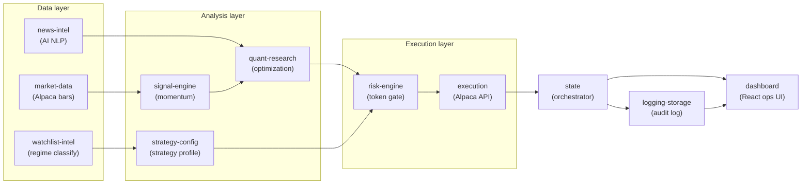
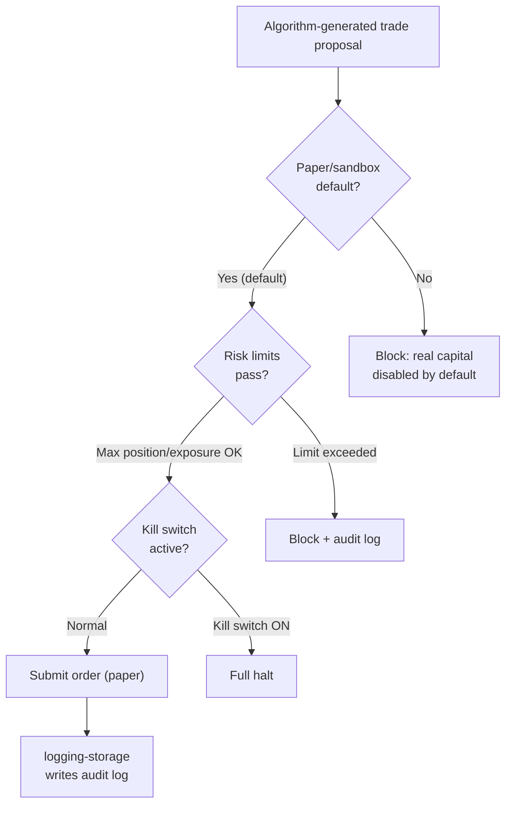

# Part 1 — Background: Why, Who, and With What

[Series Home (English)](../README.md) | [한국어 README](../README_kokr.md) | [이 문서 한국어](../ko-kr/part1_background_and_setup.md)

> *Series: Building an Algorithmic Trading System as an Investing Novice, with an AI Team (Part 1 of 5)*
>
> **Scope and limits.** Every figure in this series is realized PnL from an Alpaca **paper**
> account over a single window. It is not verified live-trading profit. The value of the series is
> the process — building a complex system with AI assistance and analyzing its result honestly —
> not the returns.

---

## Summary

- An investing non-specialist built an algorithmic trading system of **14 microservices** with the
  assistance of LLM-based AI agents acting as a development and research organization.
- The objective was not profit but a working end-to-end automation path — news collection → signal
  → portfolio optimization → risk gate → order execution — run safely in a paper environment.
- The project was run on a **minimal budget**, entirely in a paper account, with a fixed safety
  floor. The result was a small realized loss, which we analyzed causally rather than as accounting.

---

## A note on what "the AI" does here

Trading decisions are made by **code-defined algorithms** — technical-analysis signals, portfolio
optimization, and risk rules. The role of the AI agents was to help a non-specialist **develop,
research, and review** that algorithmic program, not to pick symbols or place orders in real time.
Throughout the series, "the AI team" means a development organization, and a "proposal" means
something generated in code by the algorithm services (such as quant-research), not by an LLM.

---

## 1. Who built it — a non-specialist and an AI team

The premise is straightforward: the author is not a quant. Terms like portfolio theory, the Kelly
criterion, and mean reversion are familiar, but translating them into a risk-controlled system
single-handedly was not feasible.

The approach was to assemble a development and research organization out of AI agents. Internally
called "Squad," it consists of one human and AI agents in distinct roles.

| Role | Responsibility |
|---|---|
| Lead (Product Eng. GM) | Architecture decisions, code review, cross-module coordination |
| R&D Director | Research direction, hypothesis pre-registration, validation gates |
| Principal Quant | Signal design, backtests, loss-attribution interpretation |
| Data Analyst | EDA, data profiling, missingness and coverage checks |
| Module PMs | Product ownership of each backend service |

The structure embodies the first methodological point of the series: when a non-specialist enters an
expert domain with AI, treating the agents as a **team that holds itself in check** — rather than an
oracle that hands back answers — filters out a large share of errors early. A concrete rule
enforces this: when a reviewer rejects work, a **different** agent must produce the revision, not the
original author. Quality comes from independent review, not consensus.

---

## 2. What we built — 14 microservices

InvestIQ automates U.S. equity swing trading under an **approval-gated** model: analysis is
automated, execution requires human approval.

Each service is independently deployable and bundled with Docker Compose. The core services:

| Service | Port | Role |
|---|---|---|
| market-data | 8012 | Alpaca daily/minute bars; signal inputs with provenance |
| news-intel | 8019 | Multi-source news (RSS, Reddit, SEC 8-K) + AI sentiment analysis |
| signal-engine | 8013 | BUY/SELL/HOLD momentum signals on completed daily bars |
| watchlist-intel | 8018 | Symbol universe, DIA/SPY/VIXY regime classification, premarket snapshots |
| quant-research | 8016 | 5-stage quality-gate screener, Markowitz + Risk Parity optimization, backtests |
| risk-engine | 8011 | Order-intent validation, position/loss limits, HMAC approval tokens |
| execution | 8014 | Alpaca order submission, fill reconciliation, execution reports |
| state | 8015 | Market-session orchestrator, lifecycle, proposal engine |
| logging-storage | 8010 | Append-only event log (JSONL), trade logs |

The execution service follows a **fail-closed** first principle: no order is submitted without an
HMAC token from risk-engine. Standing up this gate before anything else, even for a paper MVP,
reflects a deliberate priority — the point at which an algorithm-generated proposal is forwarded to
a broker is the highest-risk step in the system, and a veto layer belongs in code, not in process.

---

## 3. The environment — a paper MVP and a safety floor

The project was run on a **minimal budget**, with every trade executed in an Alpaca **paper
(sandbox)** account. To keep the build **cost-effective** and to contain the failure mode that most
threatens a non-specialist running automation — a defect producing unintended orders — a minimum
safety floor was fixed from the start.

The safety floor:

- **Paper/sandbox is the default.** Real-capital opt-in is disabled by default.
- A **kill switch** is always operational.
- **Max position / exposure limits** are enforced.
- **Server-side secrets only** — no API keys exposed to the browser.
- **Every trading-relevant decision is recorded in an audit log.**

Beyond safety, the paper environment serves **reproducibility**. Live capital cannot undo a fill
once it happens; paper allows the same strategy to be re-run to isolate cause from coincidence. That
property is what made the causal loss analysis in Part 4 possible.

