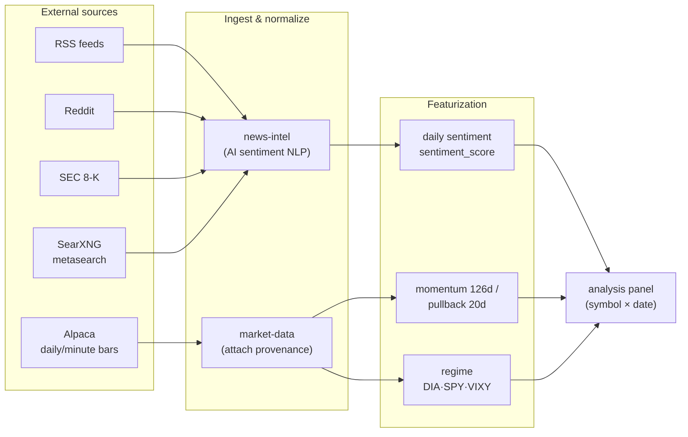
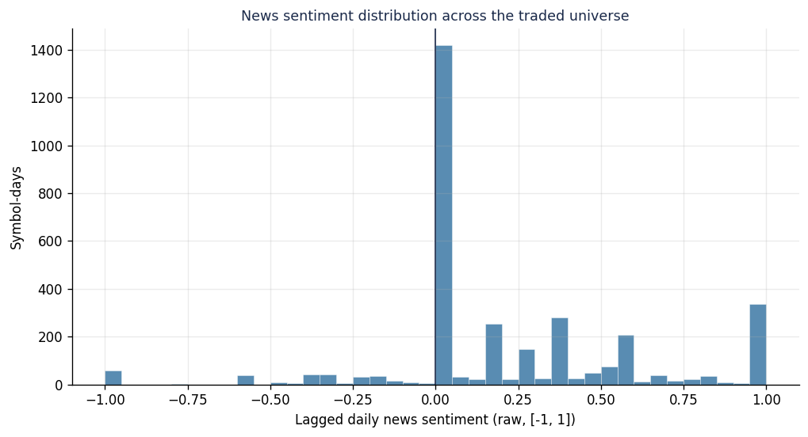

# Part 2.1 — Data: The Ingestion Pipeline and the Source of Truth

[Series Home (English)](../README.md) | [한국어 README](../README_kokr.md) | [이 문서 한국어](../ko-kr/part2_1_data_pipeline.md)

> *Series: Building an Algorithmic Trading System as an Investing Novice, with an AI Team (Part 2.1 of 5)*
>
> **Scope and limits.** All performance figures are realized PnL from an Alpaca paper account over a
> single window. This sub-part covers data provenance and verification — where the numbers come from
> and how we confirmed they are real. Part 2.2 examines how the universe was selected; Part 2.3 tests
> what that selection means against a control group.

---

## Summary

- The system ingests from multiple sources: Alpaca market bars, and multi-source news (RSS, Reddit,
  SEC 8-K) processed by the news-intel service into per-symbol sentiment.
- All prices come from Alpaca — the same broker that executed the trades. No third-party price vendor
  sits in the analysis path; provenance and execution stay on one source.
- The central data lesson: the local event journal recorded that orders were *sent* but not the
  prices they *filled* at. The fix was to go to the broker's own record — the Alpaca filled-order API
  returns the actual fills, the authoritative basis for the loss analysis in Part 4.

---

## 1. What we collected — the ingestion pipeline

- **Prices (market-data):** Daily and minute bars from Alpaca, each tagged with **provenance**
  (source and timestamp). Without the ability to trace when and where a number came from, a loss
  cannot be audited afterward.
- **News (news-intel):** RSS, Reddit, and SEC 8-K aggregated and scored per symbol by AI NLP.
- **Regime (watchlist-intel):** Market regime classified from DIA, SPY, and VIXY proxies.

Provenance is the part most easily overlooked. "Apple closed at $195" is not information; "Alpaca
adjusted close $195.32 at the 2026-03-27 market close" is. Without source and timestamp, a later
suspicion that a signal peeked at future data (lookahead) can never be cleanly dismissed.

---

## 2. One price source: Alpaca

A deliberate design choice is that **every price in the analysis comes from Alpaca Market Data** —
the same account that executed the trades. The downstream studies pull adjusted daily bars directly
from Alpaca's market-data endpoint rather than any external price provider.

Keeping execution and analysis on one price source removes a class of reconciliation errors: the
prices used to evaluate the strategy are the prices the broker itself reports. It also keeps the
provenance chain short — one vendor, one timestamp convention, one adjustment method.

---

## 3. Coverage and sparsity

*Figure. Symbol × date sentiment coverage across the 133-name traded universe over 44 trading days.
Filled cells are a fraction of the grid — news is inherently sparse.*

*Figure. The distribution of lagged daily news sentiment. A large share of symbol-days carry
neutral (zero) sentiment — on most days, most symbols have no meaningful news.*

Because news is sparse, the design treats sentiment as one input among several rather than the
primary return driver. When a signal is sparse, over-weighting it amplifies noise; the appropriate
role is a filter or overlay, which is how the composite score in Part 3 uses it.

---

## 4. The source of truth: the broker's filled-order record

The loss analysis is built on the broker's own **filled-order record**. The **Alpaca filled-order
API** returns the actual fills: for this experiment, 866 orders, 742 filled, and 1,314 individual
fills over 2026-04-13 to 2026-06-13. Matching those fills into round-trips by FIFO produced the
realized PnL that Part 4 analyzes — **−$369.85 across 927 closed round-trips**.

| Data item | Result |
|---|---|
| Source of truth | Alpaca filled-order record (orders + account activities) |
| Orders / filled / fills | 866 / 742 / 1,314 |
| Closed long round-trips (FIFO) | 927 |
| Realized PnL | −$369.85 |

The principle: the broker's filled-order history is the authoritative record, and the loss analysis
is built directly on it. The one remaining gap — 22 short-side fills not yet closed into round-trips
— is noted and excluded rather than papered over.

> **Next:** Part 2.2 turns from "what we collected" to a sharper question — **which symbols entered
> the traded universe at all**, and how much of the apparent performance lives in that selection
> rather than in the day-to-day signal.

