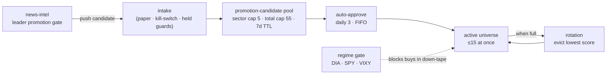

# Part 2.2 — Universe Selection: How InvestIQ Decides What to Trade

[Series Home (English)](../README.md) | [한국어 README](../README_kokr.md) | [이 문서 한국어](../ko-kr/part2_2_universe_selection.md)

> *Series: Building an Algorithmic Trading System as an Investing Novice, with an AI Team (Part 2.2 of 5)*
>
> **Scope and limits.** Realized and backtested figures from an Alpaca paper account, single window.
> This sub-part explains, against the actual code, **how InvestIQ actually builds its trading
> universe** — discovery → promotion → active universe → rotation → regime gate — and shows the
> trading set that results. Whether that selection has real skill is tested against a control group
> in Part 2.3.

---

## Summary

- "What to trade" is the single authority of the **watchlist-intel** service in InvestIQ. It admits
  and removes symbols through a **capped rule pipeline**, not free discretion.
- The flow is **discovery (news-intel) → promotion-candidate pool → auto-approve → active universe
  (≤15 at once) → rotation**, with hard caps at every stage: daily auto-approve **3**, per-sector
  **5**, candidate pool total **55**, active **15**.
- On top of that, a **regime gate** (DIA·SPY·VIXY proxies) blocks new buys in a down-tape.
- Because the active universe is capped at 15 concurrent names, the pipeline cycled through them so
  that **133 symbols were traded cumulatively** over the 44-day window — the population analyzed in
  Parts 2.3 and 4.

---

## 1. The universe is owned by an authority service

In InvestIQ the trading universe is not a config value scattered somewhere; it is the authority of a
single service, **watchlist-intel** (8018). It is the only path by which a symbol is admitted,
enabled, or removed, and it also classifies the market regime. The key point is that it runs on
**rules and caps fixed in code**, not on a human's or an LLM's discretion.

Below, each stage follows the rules exactly as verified in the code.

---

## 2. Discovery — the news-intel leader promotion gate

Candidates originate in news-intel. From the multi-source news (Part 2.1) it accumulates a **leader
score** and a **sentiment score** per symbol, turns each into an EWMA z-score, and computes a
composite:

$$\text{composite} = 0.6 \times z_{\text{ewma}}(\text{leader}) + 0.4 \times z_{\text{ewma}}(\text{sentiment})$$

It then applies a **cross-section p80 gate** — a name must be in the top quintile (80th percentile)
of that day's candidate cohort to pass. A warm-up fallback handles short histories:

| History n | Behavior |
|---|---|
| n < 5 | reject all (`warmup_zero`) |
| 5 ≤ n < 10 | fixed z ≥ 1.0 instead of cohort p80 |
| 10 ≤ n < 20 | standard p80, but daily cap reduced 3 → 2 |
| n ≥ 20 | standard |

A separate path, **sector-trend auto-enrollment**, promotes names that sit in a
positive-momentum sector and clear a threshold of positive-sentiment days over a 14-day window. So
discovery itself is **biased toward names that are good on both momentum and sentiment** — the origin
of the selection effect Part 2.3 will test.

---

## 3. Promotion — capped auto-approval

A discovered candidate is pushed to watchlist-intel's **intake** endpoint and enters the candidate
pool. From here, safety guards and hard caps apply:

- **Paper-only · kill-switch guards:** if the account is not paper or the kill switch is engaged,
  intake itself is rejected (503).
- **Held-symbol protection:** a symbol already held is not re-admitted as a candidate — unless its
  reactivation score is ≥ 0.75.
- **Sector cap 5 · total cap 55:** exceeding 5 per sector or 55 across the pool yields `rejected_cap`.
  Candidates are held as `pending` with a **7-day TTL**.

Approval is a separate **auto-approve** stage (`auto_approve_pending`):

- It approves **up to 3 per UTC trading day** (`DAILY_AUTO_CAP`), **FIFO** (earliest-discovered
  first).
- Each run must re-pass paper-only, kill-switch, rebalancing-lock, and state-reachable (held-symbol
  lookup) guards; if any fail, the whole day's auto-approval is skipped.
- Approved entries are recorded as `reviewedBy = "auto-approve"`, and the operator can review/reject
  them within the 24h TTL.

In short, "which symbols become tradable today" is not an ad-hoc human call but is structurally
limited to those that **pass the paper/kill-switch/held guards, within the daily-3, sector-5, total-55
caps.**

---

## 4. The active universe and rotation

The active universe is capped at **15 concurrent symbols**. This scoring and rotation run not as a
separate batch but inside the **premarket-snapshot cycle** (pre-open, 04:00·08:35 ET): auto-approve
runs just before the snapshot is built, and if a new name needs a slot while 15 are already enabled,
rotation is triggered on the spot to evict the weakest name. It has nothing to do with the news
pipeline or the nightly post-market batch.

The rotation score combines two signals over a 20-day window, **each min-max normalized to `[0,1]`
across the active names**, then weighted:

$$\text{rotation} = 0.6 \times \widehat{\text{buy\_freq}} + 0.4 \times \widehat{\text{realized\_pnl}}$$

- **buy_freq:** the fraction of days the name received a `buy` recommendation in watchlist-intel's own
  recent premarket snapshots. That recommendation comes from **technical indicators** (trend,
  momentum, data freshness), not news sentiment.
- **realized_pnl:** **realized PnL in dollars** accumulated over the 20-day window from
  logging-storage execution reports — not a percentage return.
- A name must accrue at least 10 active days and have no open positions to be eligible (guards); after
  normalization the lowest-scoring name is evicted.

Because both are `[0,1]` relative ranks, rotation keys off **relative weakness among the current
active names**, not absolute performance. Because of this cap + rotation, the active universe is
always small (≤15), while **the cumulative count of traded names grows much larger** over time — good
names come in, weak ones drop out.

The purpose of the cap + rotation is not merely "what to pick" but, one level above that, to
**continuously manage the input pool**. It does four things:

1. **Keep the candidate pool clean.** The cap + rotation keep the pool small and strong, preventing
   weak names from lingering and contaminating downstream decisions.
2. **Manage next-cycle performance.** Even if today's decision is already made, the pool to be used in
   tomorrow's / the next premarket snapshot must be kept in shape — so underperformers are pushed out
   early and slots are reserved for more promising names.
3. **Reflect execution reality.** It uses not just signal scores but actual realized PnL (the
   `realized_pnl` above), separating "names that look good in theory" from "names that actually make
   money."
4. **Bound operational complexity.** Growing the universe without limit makes monitoring, decisions,
   and fill management explode. The 15-name cap is the ceiling that preserves strategy consistency and
   operational stability.

---

## 5. The regime gate — the top-level switch on when to buy

Above symbol selection sits a market-wide switch. watchlist-intel classifies the regime from
DIA·SPY·VIXY proxies:

| Regime | Avg-momentum threshold | Effect |
|---|---|---|
| Strong Bull | ≥ +3.0 | normal participation |
| Mild Bull | ≥ +1.0 | normal participation |
| Neutral | (between) | reduced participation |
| Mild Bear | < −1.0 | **new buys blocked** |
| Severe Bear | < −3.0 | **new buys blocked + defensive** |

VIXY adds a risk-direction reading (`rising-risk` · `stabilizing` · `neutral`) from its 3-day average
change and 5-day momentum, and participation, stop-loss, and take-profit multipliers vary by regime.
So even when a name passes discovery and promotion, **in a bearish regime new buying is blocked
outright** — the final gate on universe selection.

---

## 6. So the result — 133 symbols

Running this pipeline over 44 trading days yields **the 133 symbols the system actually traded** (two
out-of-scope names excluded). Because the active universe is capped at 15 concurrently, 133 is not a
single-moment holding but the trading set **accumulated across the whole window** as
discovery→promotion→rotation cycled through it. These 133 names are the population for the Part 2.3
control test and the Part 4 loss analysis.

One property matters here: these 133 names are **not a random sample.** Discovery is biased toward
good-momentum, good-sentiment names (§2), new entries are blocked in a down-tape (§5), and weak names
are rotated out (§4). So the set is structurally tilted toward "active, high-sentiment,
high-momentum small/mid-caps."

That sets up the precise question for the next part: when a universe selected this way beats the
index, is that **skill in the picking**, or **momentum it rode** (names already going up)? In-sample,
on the traded names alone, the two are indistinguishable.

> **Next:** Part 2.3 first decomposes a "rank by sentiment → hold N days" backtest to show that most
> of the apparent edge lives in the **selection stage**, not the daily signal — then builds a control
> group of non-traded names and a pre-trading placebo window to test directly whether that selection
> has genuine forward skill, or merely rode pre-existing momentum.

