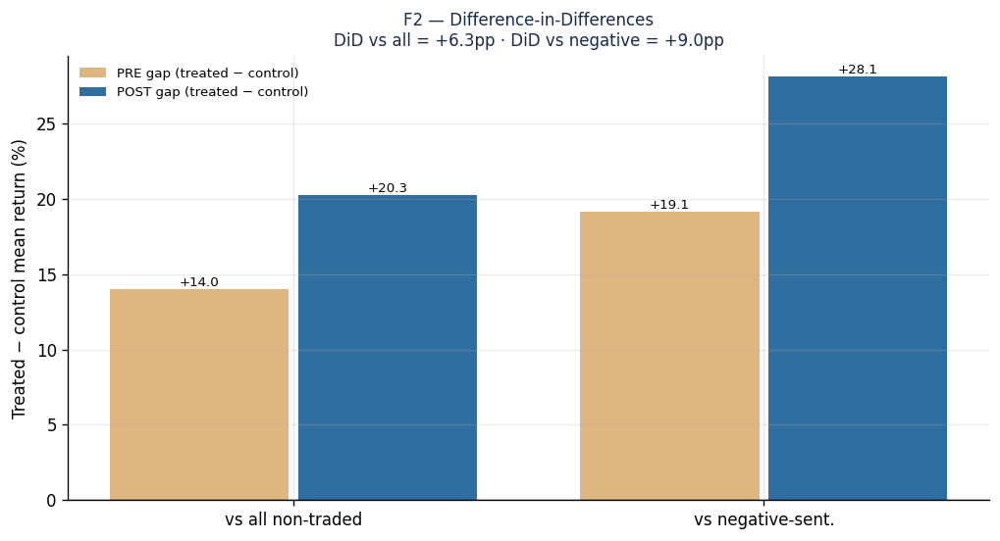

# Part 2.3 — Control-Group Comparison: What the Selection Means, and Where to Go Next

[Series Home (English)](../README.md) | [한국어 README](../README_kokr.md) | [이 문서 한국어](../ko-kr/part2_3_control_comparison.md)

> *Series: Building an Algorithmic Trading System as an Investing Novice, with an AI Team (Part 2.3 of 5)*
>
> **Scope and limits.** A quasi-experiment on Alpaca paper-account data, single window. This sub-part
> tests whether the universe selection in Part 2.2 has real forward skill, using a control group of
> non-traded symbols and a placebo window, then draws the strategic direction that follows.

---

## Summary

- We built a **control group**: the symbols the news pipeline covered but the system did **not**
  trade — including a deliberately **negative-sentiment** subset — and compared them to the traded
  names over the trading window **and the 44 days before trading began**.
- The traded universe massively outperformed the control in the trading window (+20pp), **but it had
  already outperformed by +14pp before we traded it.** The clean difference-in-differences estimate
  of forward skill is **not statistically significant.**
- Conclusion: the selection mostly **rode pre-existing momentum**, it did not demonstrably
  **predict** it. The strategic direction is to test selection with a point-in-time universe and
  out-of-sample windows — not to scale the current rule.

---

## 1. The design: treated vs control, before vs after

To ask whether selecting these names showed skill, we need to know how they would have looked
*without* the selection. So we set up a quasi-experiment:

- **Treated:** the 132 traded names.
- **Control:** non-traded but news-covered names — 2,847 broad, plus a 1,423-name
  **negative-sentiment** subset (the sharp contrast: names with clearly negative news that we did not
  trade).
- **PRE window:** the 44 trading days **before** trading began (a placebo — before the system acted).
- **POST window:** the 44-day trading window itself.

All prices come from Alpaca Market Data (no external vendor); sentiment from InvestIQ news-intel. The
design was fixed before results were inspected.

---

## 2. The naive comparison looks decisive — then collapses

In the trading window, the traded names crushed the control:

| Group | n | POST return |
|---|---:|---:|
| Treated (traded) | 132 | **+24.8%** |
| Control — all non-traded | 2,847 | +4.5% |
| Control — negative sentiment | 1,423 | −3.3% |
| SPY | — | +8.1% |

A +20pp lead over all non-traded names (t = 4.4, p = 2×10⁻⁵) looks like enormous selection skill.
But the placebo window destroys that reading. **Before** any of these names were traded, the treated
group was *already* far ahead:

| Group | PRE return |
|---|---:|
| Treated (traded) | **+10.7%** |
| Control — all non-traded | −0.7% |
| Control — negative sentiment | −8.4% |
| SPY | −1.3% |

*Figure. Mean buy-and-hold return before (light) and during (solid) trading. The treated group's
lead is already large in the PRE period — the signature of selection on pre-existing momentum.*

The treated names were not comparable to the controls before selection. They were **already the
winners.**

---

## 3. Difference-in-differences: no significant forward skill

The honest estimate nets out each group's fixed level and the pre-existing trend:
`DiD = (POST gap) − (PRE gap)`.

| Comparison | PRE gap | POST gap | **DiD** | Bootstrap 95% CI | p |
|---|---:|---:|---:|---:|---:|
| Treated − all non-traded | +14.0pp | +20.3pp | **+6.3pp** | [−3.3, +17.2] | 0.23 |
| Treated − negative sent. | +19.1pp | +28.1pp | **+9.0pp** | [−0.8, +19.9] | 0.094 |

*Figure. The treated−control gap was already +14pp (vs all) / +19pp (vs negative) before trading; it
widened to +20pp / +28pp during. The increment (DiD) is small and not significant.*

**Both intervals include zero.** Of the +20.3pp post-period lead, **+14.0pp (≈69%) already existed
before trading.** Once the pre-existing trend is removed, the forward skill of the selection is
**statistically indistinguishable from zero.** The selection captured names that were already rising;
it did not demonstrably forecast which would rise.

A dose-response check (forward return vs in-window sentiment) shows a strong positive slope, but the
sentiment there is measured over the same window as the return — contemporaneous co-movement, not
prediction. It is consistent with the DiD verdict and cannot upgrade it.

---

## 4. What the selection means

Collecting and trading only a sentiment-selected slice of NASDAQ leaves a **large, measurable, and
mostly spurious** statistical footprint:

1. **The slice beats the index by construction.** Selecting active, high-sentiment, high-momentum
   small/mid-caps means that in an up-tape they rise more than SPY. The +24.8% vs +8.1% is largely
   factor exposure, not skill.
2. **Most of the lead is pre-existing momentum.** ≈69% of the advantage over non-traded names existed
   before any trade — a universe-level look-ahead.
3. **The clean causal estimate is not significant.** Difference-in-differences cannot reject zero.
4. **It does not generalize to NASDAQ.** The control is still *news-covered* names, not a random
   draw; external validity is limited to "names the pipeline could see."

This sharpens the whole series: the apparent edge lives in the **selection stage**, but on a proper
control + placebo test that edge is **mostly momentum the system rode, not demonstrated forward
skill.**

---

## 5. Strategic direction

The finding is not a dead end — it is a redirection. It tells us where a real edge would have to come
from and how to test it honestly:

1. **Study selection, not the daily signal.** The performance lives in the universe choice, so that
   is the object worth improving and validating.
2. **Define the universe point-in-time.** Select names by a rule fixed *before* each window opens, so
   the test cannot ride moves that already happened. This removes the universe-level look-ahead that
   inflated the current result.
3. **Always carry a control group.** Keep the non-traded, news-covered names (and a
   negative-sentiment set) as a permanent benchmark, so every future claim is a treated-vs-control,
   before-vs-after comparison rather than an in-sample story.
4. **Replicate out-of-sample.** A single 44-day regime cannot confirm anything; the same pipeline
   must be re-run across other windows and tapes before any selection rule is trusted.
5. **Separate momentum from skill explicitly.** Since the current "edge" is mostly momentum, a useful
   next experiment is whether the selection adds anything *beyond* a simple momentum screen — if it
   does not, the news machinery is not earning its complexity.

The honest version of the project's conclusion is therefore methodological rather than financial: we
learned **how to measure whether a universe selection has skill** — a control group plus a placebo
window plus difference-in-differences — and applied to our own data, that measurement says **not
yet.** That is a more durable result than a single-window equity curve.

