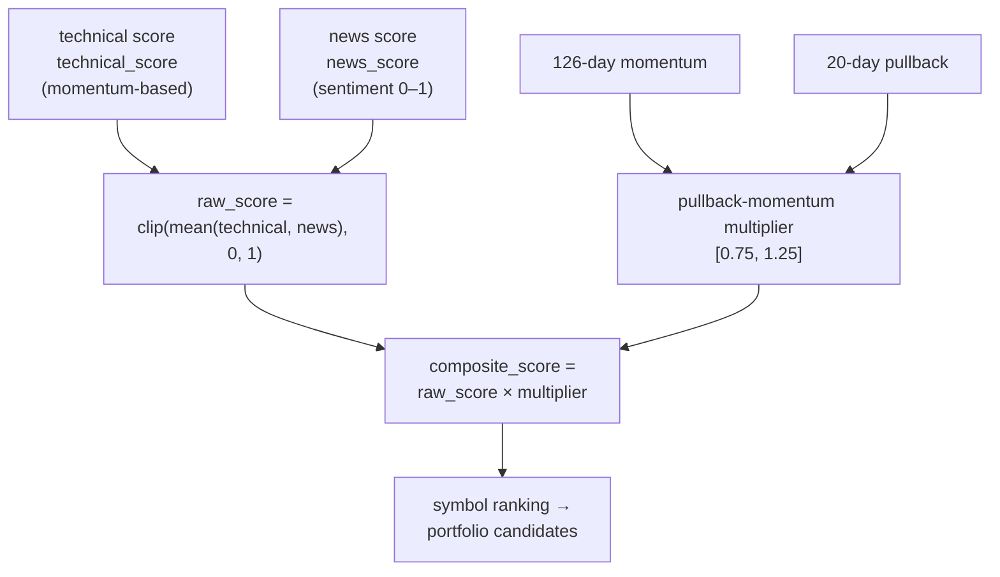

# Part 3.1 — Strategy: Scoring Symbols (the Spec-070 Composite)

[Series Home (English)](../README.md) | [한국어 README](../README_kokr.md) | [이 문서 한국어](../ko-kr/part3_1_scoring.md)

> *Series: Building an Algorithmic Trading System as an Investing Novice, with an AI Team (Part 3.1 of 5)*
>
> **Scope and limits.** Performance figures are realized PnL from an Alpaca paper account, single
> window. This sub-part covers how each symbol is scored; Part 3.2 covers the post-market pipeline
> and portfolio optimization, Part 3.3 walks a real allocation example, and Part 3.4 covers
> approval-gated execution.

---

## Summary

- Each symbol gets a **Spec-070 composite score** — a blend of a momentum/technical score and a news
  sentiment score, multiplied by a **pullback-momentum multiplier (0.75–1.25)**.
- The score is the single number that decides whether a symbol becomes a portfolio candidate.
- Signals are emitted only on **completed daily bars** to avoid lookahead.

---

## 1. The composite score

The signal combines two pieces of information: how the price moved (momentum) and what the news says
(sentiment).

Code-verified definition (`portfolio_optimization_070.py`):

- **raw_score** = `clip(mean([technical_score, news_score]), 0, 1)` — by default an equal-weighted
  average of the technical and news scores.
- **pullback-momentum multiplier** combines 126-day momentum and 20-day pullback, clamped to
  `[0.75, 1.25]`. When momentum > 0: `1 + 0.25 × min(1, mom/0.50) × min(1, pullback/0.15)`. It boosts
  the score on an uptrend with a moderate pullback — the classic "buy the healthy dip."
- **composite = raw × multiplier.**

The design hypothesis is to favor slightly pulled-back names in an uptrend. As Part 4 shows, the
strategy's edge over the experiment was marginal; the most useful lever turned out to be single-name
tail control rather than the scoring formula itself.

A separate but critical detail: signal-engine emits signals only on **completed daily bars**.
Emitting on an in-progress bar would introduce lookahead — the most common reason a backtest looks
unrealistically strong.

> **Next:** Part 3.2 takes these per-symbol scores into the **post-market pipeline**, where they
> become portfolio weights through optimization and a quality gate.

