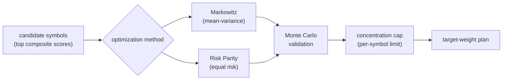

# Part 3.2 — The Post-Market Pipeline and Portfolio Optimization

[Series Home (English)](../README.md) | [한국어 README](../README_kokr.md) | [이 문서 한국어](../ko-kr/part3_2_postmarket_pipeline.md)

> *Series: Building an Algorithmic Trading System as an Investing Novice, with an AI Team (Part 3.2 of 5)*
>
> **Scope and limits.** A paper account, over a single window. This part covers the post-market batch
> pipeline and the concept of portfolio optimization. Part 3.3 walks through a real allocation
> recorded in the event log.

---

## Summary

- After the close, a post-market batch runs each night. It refreshes data, re-scores the universe,
  optimizes weights, and produces a rebalancing plan for the next session. That plan becomes the
  basis for the following day's intraday trading.
- Weights are produced by two optimizers, Markowitz (mean-variance) and Risk Parity, and pass through
  a five-stage quality gate, Monte Carlo validation, and a per-symbol concentration cap.
- This is the stage that turns per-symbol scores into an actual target portfolio.

---

## 1. The post-market batch pipeline

The system performs its batch computation **after the market closes**, when bars are final and there
is no intraday pressure. Each night the batch advances through fixed stages, emitting a
`PostMarketBatchStage.v1` event at each one so the whole run is auditable.

```mermaid
flowchart LR
    CLOSE["market close<br/>(final daily bars)"] --> DATA["data refresh<br/>(market-data, news-intel)"]
    DATA --> SCORE["re-score universe<br/>(Spec-070 composite)"]
    SCORE --> SCREEN["5-stage quality-gate<br/>screener"]
    SCREEN --> OPT["portfolio optimization<br/>(Markowitz / Risk Parity)"]
    OPT --> MC["Monte Carlo<br/>validation"]
    MC --> CAP["concentration cap<br/>+ ADV gating"]
    CAP --> PLAN["rebalancing plan<br/>(target weights → orders)"]
    PLAN --> LOG["logging-storage<br/>(audit each stage)"]
```

Running the computation post-market brings clear benefits: it removes the temptation to react to
intraday noise, it works only on completed bars so no lookahead can occur, and it consolidates the
night's decision into a single reviewable artifact rather than a stream of ad-hoc trades.

> **Note: universe management and weight optimization are different layers.**
> The active universe (watchlist-intel) of Part 2.2 and the weight optimization of this part are not
> redundant; they divide into an upper layer (universe management) and a lower layer (weight
> optimization). The weights are the day's execution plan, fixed before the open, while the active
> universe is the input-quality and rotation mechanism that keeps producing good plans. The flow is
> one-directional. watchlist-intel's enabled names, together with held positions, promotion
> candidates, and benchmarks, form this batch's input universe; the batch optimizes weights over that
> universe into target-weights; and the intraday executor orders only the delta from current
> holdings. So even though the weights are fixed first, keeping the input pool in shape for the next
> cycle is the role of the universe layer.

---

## 2. Why optimization

Picking high-scoring symbols answers *what* to hold. Optimization computes *how much* of each to
hold.

- **Markowitz (mean-variance)** chooses weights that maximize the Sharpe ratio given expected returns
  and the covariance matrix. Left unconstrained, it tends to concentrate weight into a few names it
  judges to have the best risk-adjusted return.
- **Risk Parity** instead allocates so that each name contributes equal risk, producing a flatter,
  more diversified portfolio that does not depend on fragile return forecasts.
- **The five-stage quality gate and Monte Carlo** stress-test the result by simulation before it is
  trusted.

To control concentration risk, the per-symbol concentration cap is applied not as a soft penalty in
the objective but as a hard constraint on the output, that is, on the execution path. The default is
about 15%, an exception is allowed up to roughly 20%, and the cap is tightened further in
signal-conflict or stale-regime windows. Because an optimizer does whatever is not explicitly
blocked, the limit must live on the output rather than in the objective. What happens when this cap
is absent, and how single-name concentration plays out in practice, is examined in detail in the
Part 4 loss analysis.

---

## 3. The output: a rebalancing plan

The optimization itself does not place orders. The rebalancing plan produced in the final stage of
the batch holds, for each symbol in the portfolio, the target weight, target shares, current shares,
the delta, and an action of buy, sell, or hold. Each entry is checked by the risk engine (Part 3.4)
before any order is sent.

| Field | Meaning |
|---|---|
| `targetWeight` | the portfolio weight the optimizer intends |
| `currentWeight` | the weight the portfolio currently holds |
| `targetShares` / `currentShares` | the weights translated into whole shares |
| `deltaShares` | the trade needed to move from current holdings to the target |
| `action` | buy / sell / hold |
| `riskGateStatus` | approved / blocked / capped by the risk engine |

> **Next:** Part 3.3 opens an actual rebalancing plan from the event log, a specific night's
> portfolio, and reads its weights, trades, and risk-gate decisions line by line.

