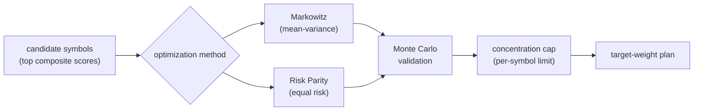

# Part 3.2 — The Post-Market Pipeline and Portfolio Optimization

[Series Home (English)](../README.md) | [한국어 README](../README_kokr.md) | [이 문서 한국어](../ko-kr/part3_2_postmarket_pipeline.md)

> *Series: Building an Algorithmic Trading System as an Investing Novice, with an AI Team (Part 3.2 of 5)*
>
> **Scope and limits.** Paper-account, single window. This sub-part covers the post-market batch
> pipeline and the concept of portfolio optimization; Part 3.3 walks a real allocation from the
> event log.

---

## Summary

- After the close, a **post-market batch** runs nightly: it refreshes data, re-scores the universe,
  optimizes weights, and produces a **rebalancing plan** for the next session.
- Weights come from two optimizers — **Markowitz (mean-variance)** and **Risk Parity** — passed
  through a **5-stage quality gate + Monte Carlo** validation and a **per-symbol concentration cap**.
- This is the stage that turns per-symbol scores into an actual target portfolio.

---

## 1. The post-market batch pipeline

The system does its heavy thinking **after the market closes**, when bars are final and there is no
intraday pressure. Each night a batch advances through fixed stages, emitting a
`PostMarketBatchStage.v1` event at each one so the whole run is auditable.

```mermaid
flowchart LR
    CLOSE["market close<br/>(final daily bars)"] --> DATA["data refresh<br/>(market-data, news-intel)"]
    DATA --> SCORE["re-score universe<br/>(Spec-070 composite)"]
    SCORE --> SCREEN["5-stage quality-gate<br/>screener"]
    SCREEN --> OPT["portfolio optimization<br/>(Markowitz / Risk Parity)"]
    OPT --> MC["Monte Carlo<br/>validation"]
    MC --> CAP["concentration cap<br/>+ ADV gating"]
    CAP --> PLAN["rebalancing plan<br/>(target weights → orders)"]
    PLAN --> LOG["logging-storage<br/>(audit each stage)"]
```

Running post-market matters for a non-specialist: it removes the temptation to react to intraday
noise, it works on **completed** bars (no lookahead), and it makes the night's decision a single
reviewable artifact rather than a stream of ad-hoc trades.

---

## 2. Why optimization — and the concentration trap

Picking high-scoring symbols answers *what* to hold. Optimization answers *how much* of each — and
this is where a novice gets hurt most, through **concentration**.

- **Markowitz (mean-variance)** chooses weights that maximize the Sharpe ratio given expected returns
  and the covariance matrix. Left unconstrained, it tends to pile weight into a few names it believes
  have the best risk-adjusted return.
- **Risk Parity** instead allocates so each name contributes **equal risk**, producing a flatter,
  more diversified book that does not depend on fragile return forecasts.
- **5-stage quality gate + Monte Carlo** stress-tests the result by simulation before it is trusted.

A real failure mode surfaced here: an optimizer can assign an outsized weight to a single name (in
one observed case, above 23%) when the per-symbol cap is expressed as a **soft penalty in the
objective** rather than a **hard constraint on the execution path**. The correction is a hard
per-symbol cap — a default near 15%, a maximum exception near 20%, tightened in signal-conflict or
stale-regime windows. The principle: an optimizer does whatever is not explicitly blocked, so caps
belong on the output, not in the objective.

---

## 3. The output: a rebalancing plan

The optimization does not place orders. It produces a **rebalancing plan** — a per-symbol table of
target weight, target shares, current shares, the delta, and an action (buy / sell / hold). Each
entry is then checked by the risk engine (Part 3.4) before any order is sent.

| Field | Meaning |
|---|---|
| `targetWeight` | the optimizer's desired share of the portfolio |
| `currentWeight` | what the book holds now |
| `targetShares` / `currentShares` | whole-share translation of the weights |
| `deltaShares` | the trade needed to move from current to target |
| `action` | buy / sell / hold |
| `riskGateStatus` | approved / blocked / capped by the risk engine |

> **Next:** Part 3.3 opens an actual rebalancing plan from the event log — a real night's portfolio —
> and reads its weights, trades, and risk-gate decisions line by line.

