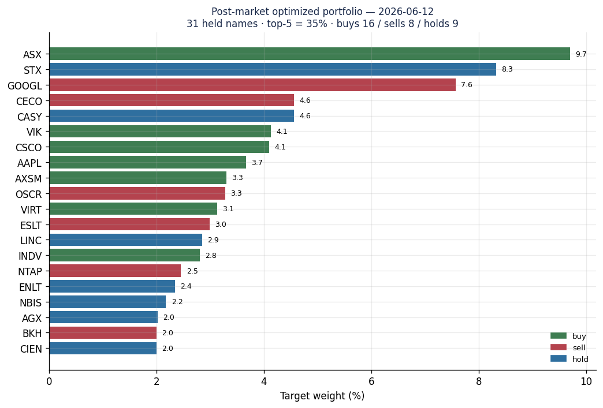

# Part 3.3 — A Real Allocation, Read Line by Line

[Series Home (English)](../README.md) | [한국어 README](../README_kokr.md) | [이 문서 한국어](../ko-kr/part3_3_real_allocation_example.md)

> *Series: Building an Algorithmic Trading System as an Investing Novice, with an AI Team (Part 3.3 of 5)*
>
> **Scope and limits.** Paper-account, single window. Every number in this sub-part is taken directly
> from the InvestIQ event log — a real post-market rebalancing plan, not a worked-up example.

---

## Summary

- We open one actual night's output — the rebalancing plan for **2026-06-12**
  (`rebal-20260613T022809Z`) — and read its real weights, trades, and risk-gate decisions.
- The plan held **31 names**, with the **top 5 at ~35%** and a per-name target weight ceiling
  near 10%; it generated **16 buys, 8 sells, 9 holds**, and the risk engine **blocked 3** of them.
- This is what portfolio optimization actually looks like in practice — concentration control,
  whole-share rounding, and a veto layer — rather than in theory.

---

## 1. The night's portfolio

After the 2026-06-12 close, the post-market batch produced a 33-entry plan, of which **31 carried a
positive target weight.** Ranked by weight:

*Figure. Target weights of the 2026-06-12 plan, colored by action (green buy, red sell, blue hold).
ASX leads at 9.7%, then STX 8.3%, GOOGL 7.6%, with a long tail of ~2% positions.*

| Symbol | Target weight | Action | Shares (cur → target) |
|---|---:|---|---|
| ASX | 9.70% | buy | 0 → 61 |
| STX | 8.32% | hold | 2 → 2 |
| GOOGL | 7.57% | sell | 6 → 5 |
| CECO | 4.56% | sell | 12 → 11 |
| CASY | 4.56% | hold | 1 → 1 |
| VIK | 4.13% | buy | 5 → 10 |
| CSCO | 4.10% | buy | 7 → 8 |
| AAPL | 3.67% | buy | 0 → 3 |

The **top 5 names sum to ~35%** and no single position exceeds ~10% — the concentration cap from
Part 3.2 is visibly doing its job. The long tail sits near a 2% floor, the diversified body that
Part 4's loss analysis found to be healthy.

Across the **14 trading days** ending 2026-06-12, the post-market batch rotated through **127
distinct names** — a high-turnover book where a handful of positions persist while most cycle in and
out:

*Figure. Target-weight history over the last 14 post-market rebalances (most persistent names as
rows). A few positions (INDV, STX, ENLT, ECO) hold weight for many days; most names appear briefly,
consistent with the diversified, high-turnover profile seen in the realized record.*

## 2. Weights become whole shares

Optimization produces *weights*, but a broker trades *shares*. The plan translates each target weight
into target shares at the latest price, then computes the delta from the current holding:

- **VIK** — target 4.13%, holding 5 shares, target 10 → **buy 5 shares (~$461).**
- **GOOGL** — target 7.57% but currently 8.95% (overweight) → **sell 1 share** to trim back.
- **OSCR** — target 3.28% vs current 7.38% (well overweight) → **sell 36 shares** (63 → 27).

Whole-share rounding matters at a small account size: a 2% target on a $24k book is roughly $480, so
a single high-priced share can overshoot a target weight. The plan accepts that granularity rather
than pretending fractional precision it cannot execute.

## 3. The risk engine vetoes three trades

The optimizer is not the final word. Of the 33 entries, the risk engine **blocked 3** — and the
reason is instructive:

| Symbol | Plan action | Risk-gate status | Reason |
|---|---|---|---|
| AAPL | buy | **blocked** | direction_lock: plan requires SELL, intraday BUY blocked to prevent thrashing |
| ASX | buy | **blocked** | direction_lock: same conflict |
| INDV | buy | **blocked** | direction_lock: same conflict |

These are **direction-lock** blocks: the daily rebalancing plan and the intraday state disagreed on
direction for the same name, and rather than let the system buy and sell the same symbol in a short
window (thrashing, which burns spread and looks like activity without intent), the risk engine
refuses the conflicting leg. A separate entry (**USAR**) was held under a `post_stop_cooldown` —
a name recently stopped out is not re-bought immediately.

This is the safety floor from Part 1 operating on real output: even a fully-formed, optimized,
quality-gated plan does not reach the broker unchanged. The veto layer is the last check.

## 4. What the example teaches

Reading one real plan makes the abstract pipeline concrete:

1. **Optimization is constrained, not free.** The visible top-5 ≈ 35% and the ~10% per-name ceiling
   are the concentration caps, not the optimizer's unconstrained preference.
2. **Execution is lossy by design.** Weights round to whole shares; small targets become coarse
   trades; that approximation is disclosed, not hidden.
3. **The plan is a proposal, not an order.** Three trades were blocked at the gate. The system
   proposes; the risk engine disposes.

> **Next:** Part 3.4 follows an approved plan entry through the **approval-gated execution** path —
> propose → review → execute — and the HMAC token that guards every order.

