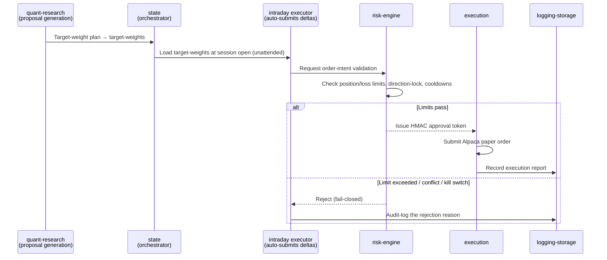

# Part 3.4 — From Plan to Order: Automated Execution with a Coded Veto

[Series Home (English)](../README.md) | [한국어 README](../README_kokr.md) | [이 문서 한국어](../ko-kr/part3_4_approval_gated_execution.md)

> *Series: Building an Algorithmic Trading System as an Investing Novice, with an AI Team (Part 3.4 of 5)*
>
> **Scope and limits.** Paper-account, single window. This sub-part covers how a rebalancing plan
> becomes a broker order **automatically, with no human in the per-trade loop**, and how a
> **coded risk-engine** holds the veto on that path.

---

## Summary

- InvestIQ is a **fully automated** algo-trading system: from proposal to order submission there is
  no per-trade human approval. **The algorithm proposes, and a coded risk-engine holds the veto.**
- No order reaches the broker without an **HMAC token** from risk-engine — a token-less order is
  treated as forged.
- The default is **fail-closed**: when in doubt, block. Every decision is preserved in an audit log.
- The only human gate is not per-order but the **live-capital (real money) arming switch**. Paper
  runs unattended, and the executor is **paper-only by hardcoded contract** (it refuses to submit if
  live is enabled).

---

## 1. The automated execution flow

A "proposal" here is the rebalancing plan from Part 3.3, generated in code by the algorithm service —
not by an LLM. The nightly post-market batch writes it as `target-weights`, and **at session open the
intraday executor reads it and orders — with no human intervention** — only the delta from current
holdings. Every order executes only after passing a fixed code gate.

Part 3.3's three blocked trades (AAPL, ASX, INDV direction-locks) are exactly the `else` branch
firing on real output: the plan asked to buy, **the gate — code, not a human — said no**, and the
rejection reason was logged.

## 2. Key properties

1. Both proposal generation and order execution are **fully automated**. There is no per-trade human
   approval step.
2. risk-engine puts a cryptographic gate on every order via an **HMAC token** — a token-less order is
   treated as forged.
3. **fail-closed**: when in doubt, block. The default is rejection, not passage.
4. Every decision is preserved in an **audit log** (`logging-storage`).

The HMAC mechanism turns inter-module trust from a promise into a cryptographic proof: whether an
order is a legitimate algorithm proposal or a stray order created by a defect, execution rejects it
unless it carries a valid risk-engine token. For a fully automated system built by a non-specialist,
placing the veto **in code rather than in a human's attention** is what produces safety.

## 3. Where the human stays — the live-capital arming switch

In paper operation the human is not in the per-order loop. The single gate a human holds is the
**per-trading-date switch that arms live (real-capital) mode** — default off, never turned on in this
paper series, and the executor is paper-only by hardcoded contract anyway. So the human controls
*whether real money is at stake*, not *which names get traded*.

The rest of the human's role sits not in the execution loop but in the **development and research
layer** (Part 5): designing and validating the strategy, and hard-coding the caps and veto. The
safety of full automation comes not from a human click at the final step but from a **coded,
fail-closed veto at the money-moving step**, with the kill switch and live-capital arming switch above
it.

> **Next:** Part 4 opens the realized record and reads the loss causally — what the −$369.85 over 927
> round-trips actually was, and why a single name decided the period.

