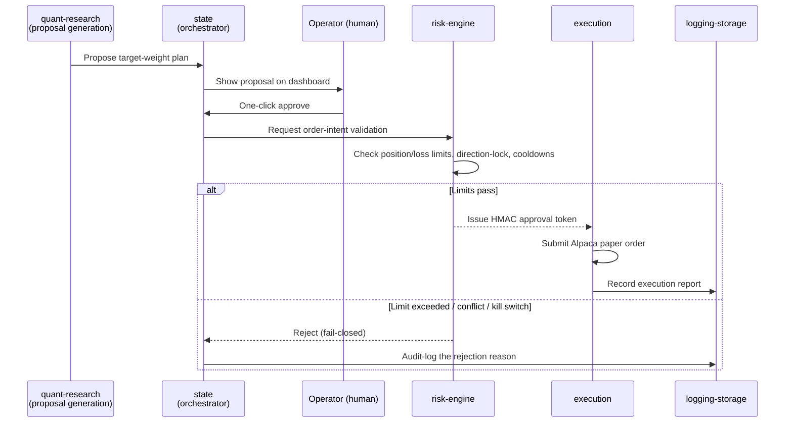

# Part 3.4 — From Plan to Order: Approval-Gated Execution

[Series Home (English)](../README.md) | [한국어 README](../README_kokr.md) | [이 문서 한국어](../ko-kr/part3_4_approval_gated_execution.md)

> *Series: Building an Algorithmic Trading System as an Investing Novice, with an AI Team (Part 3.4 of 5)*
>
> **Scope and limits.** Paper-account, single window. This sub-part covers how an approved
> rebalancing-plan entry becomes a broker order under the approval gate.

---

## Summary

- The system's philosophy: **the algorithm proposes, the human approves, and the risk engine holds
  the veto.**
- No order reaches the broker without an **HMAC token** from risk-engine — a token-less order is
  treated as forged.
- The default is **fail-closed**: when in doubt, block. Every decision is preserved in an audit log.

---

## 1. The approval-gated flow

A "proposal" here is the rebalancing plan from Part 3.3, generated in code by the algorithm service —
not by an LLM. It moves to execution only through a fixed gate.

Part 3.3's three blocked trades (AAPL, ASX, INDV direction-locks) are exactly the `else` branch
firing on real output: the plan asked to buy, the gate said no, and the rejection reason was logged.

## 2. Key properties

1. The proposal is **auto-generated**, but execution requires **human approval**.
2. risk-engine puts a cryptographic gate on every order via an **HMAC token** — a token-less order is
   treated as forged.
3. **fail-closed**: when in doubt, block. The default is rejection, not passage.
4. Every decision is preserved in an **audit log** (`logging-storage`).

The HMAC mechanism turns inter-module trust from a promise into a cryptographic proof: whether an
order is a legitimate algorithm proposal or a stray order created by a defect, execution rejects it
unless it carries a valid risk-engine token. For a system built by a non-specialist, this structural
distrust is what produces safety.

## 3. Why a human stays in the loop

The propose → review → execute pattern keeps a person at the one step where money moves. Full
automation is not always correct; the less expert the builder, the more a human and a veto layer
belong at the final step. The cost is one click per night; the benefit is that no optimizer error,
data glitch, or code defect can place an order on its own.

> **Next:** Part 4 opens the realized record and reads the loss causally — what the −$369.85 over 927
> round-trips actually was, and why a single name decided the period.

