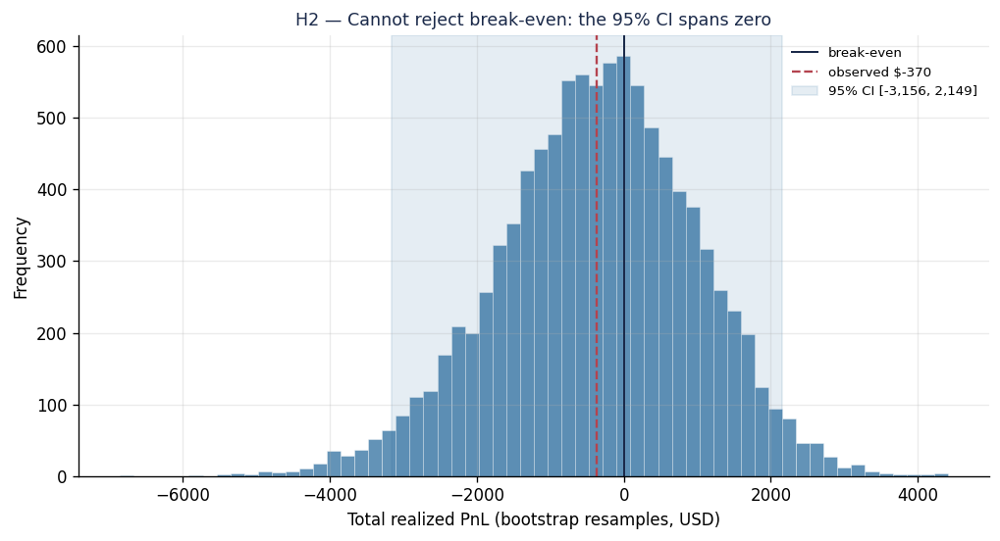
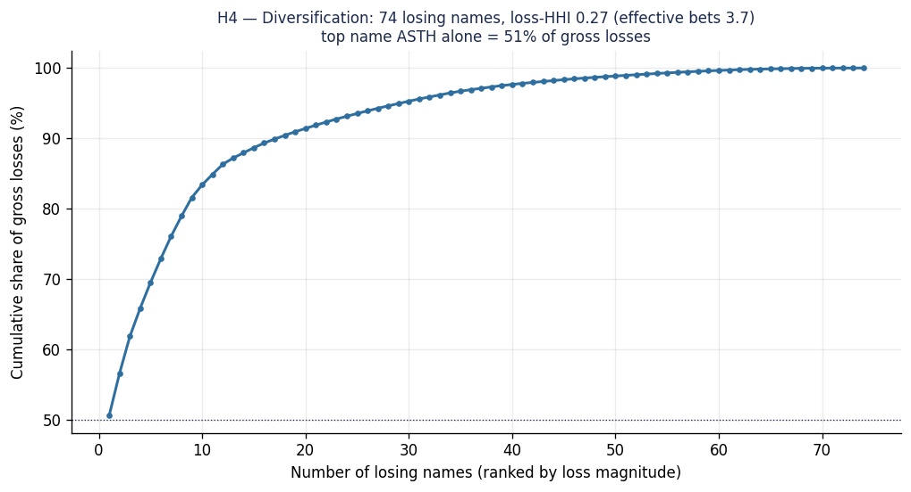
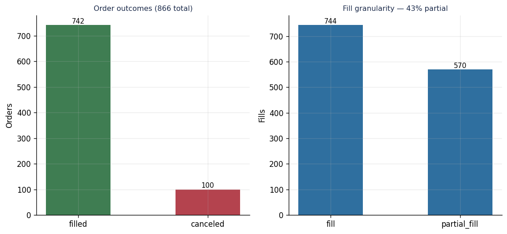
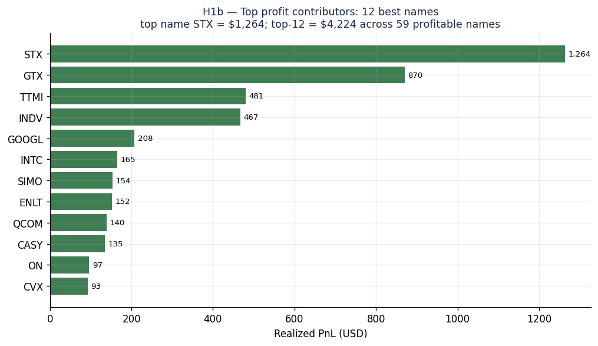

# Part 4 — What the Loss Actually Was: A Causal Reading of the Record

[Series Home (English)](../README.md) | [한국어 README](../README_kokr.md) | [이 문서 한국어](../ko-kr/part4_loss_attribution.md)

> *Series: Building an Algorithmic Trading System as an Investing Novice, with an AI Team (Part 4 of 5)*
>
> **Scope and limits.** The figures below come from an Alpaca **paper** account, reconstructed from
> the broker's own **filled-order record** over a single window (2026-04-13 to 2026-06-13). They are
> real fills, not a proxy — but they cover one regime and one short window, so the attribution should
> be read as a description of this experiment, not a general result. **The system is long-only by
> design and did not run a short strategy** (a handful of incidental residual shorts in the record are
> explained in Section 1). **There is one bottom line: at the current mark-to-market, the account's
> equity changed by ≈ −$878** (the operator's equity moved from ~$25,000 to ~$24,122). The per-name
> attribution below is built on one slice of that change — the **long-only closed round-trip realized
> PnL of −$369.85** — which Section 1 ties back to the −$878 with a full equity bridge.

---

## Summary

- The account's **equity fell by ≈ −$878** over the window. That breaks down as **realized
  (long + incidental shorts) −$452 + unrealized open positions −$339 + fees/slippage −$88**.
- The per-name attribution uses the **−$369.85 long-only closed round-trip** figure across **927
  round-trips in 133 names** — economically near break-even, not a structural blowup.
- A bootstrap of the per-trade outcomes places the 95% confidence interval at **[−$3,156, +$2,149]**,
  which spans zero: the result is **statistically indistinguishable from break-even**.
- Almost the entire net loss came from one name. **ASTH alone lost −$2,712, while the rest of the
  book made +$2,343**; that single large loss offset the gains and pulled the total to −$370. The
  strategy is diversified; the only concentration is a single-name tail.
- The profile is a **low hit rate (41.7%) with a positive payoff (1.31)** — a marginally negative
  expectancy that small improvements would flip positive.
- In a separate study, the news-sentiment signal was **directionally consistent but
  underpowered** over this window — neither validated nor refuted.

---

## 1. The result: current mark-to-market equity, −$878

The result of this window is a single number: at the current mark-to-market, the account's **equity
changed by about −$878** (≈$25,000 → ≈$24,122). The per-name attribution is built on one slice of
that change: the **long-only closed round-trip realized PnL of −$369.85**, obtained by FIFO-matching
buys to sells per symbol over the window. That figure measures *closed long trades only* — one
component of the −$878, not a rival headline; the rest comes from the three components below.

Three components bridge −$369.85 to −$878. They are computed by `reconcile_equity.py` and reconcile
exactly:

| Component | Amount | Why the round-trip figure misses it |
|---|---:|---|
| Realized PnL (incl. incidental shorts) | −$451.50 | 22 `sell_short` fills, created when a sell exceeded the held quantity, open short positions the long-only matcher drops |
| **Unrealized** PnL (37 open positions marked at the 2026-06-12 close) | −$338.66 | a realized-only matcher never marks open inventory (net +188 long / −56 short shares) |
| **Fees / slippage / rounding** | −$87.84 | not contained in fill prices (0.009% of gross traded notional) |
| **Total equity change** | **−$878.00** | matches the observed balance |

Note that the system is **long-only by design** and does not deliberately short. The 22 `sell_short`
fills above are not a short strategy but **incidental residual shorts** — sells whose quantity
exceeded the position held at that moment — included here only so the equity bridge reconciles
exactly.

The rest of this part analyzes the clean, matched long record (−$369.85), with the single caveat that
short legs and open positions add roughly −$420 more on top of it to reach the −$878 total.

| Metric (long-only closed round-trips) | Value |
|---|---|
| Realized PnL | −$369.85 |
| Round-trips | 927 (133 symbols) |
| Win rate | 41.7% (387 W / 538 L) |
| Average win / loss | +$14.93 / −$11.43 |
| Payoff ratio | 1.31 |
| Expectancy per trade | −$0.40 |
| Profit factor | 0.94 |
| Bootstrap 95% CI | [−$3,156, +$2,149] |

---

## 2. The loss is a single-name tail event (H1)

The first and decisive finding: one name set the sign of the entire period.

*Figure. The twelve worst contributors. ASTH alone realized −$2,712 — more than seven times the
−$369.85 net loss. The next-largest losers (PARR −$321, ECO −$282, ESE −$216, GE −$197) are an order
of magnitude smaller. Excluding ASTH the book is +$2,343, and that single loss offsetting the rest is
what pulls the total to −$370.*

This reframes the whole exercise. The loss is not the product of a broadly bad strategy; it is a
single-name tail event against an otherwise positive book. The corrective lever is therefore
**single-name tail control**, not broad de-risking.

## 3. The result is indistinguishable from break-even (H2)

How confident can we be that the strategy loses money at all? Not very.

*Figure. Bootstrapping the 927 per-trade outcomes (10,000 resamples) gives a 95% interval for total
PnL of [−$3,156, +$2,149]. The interval spans zero; 40% of resamples are non-negative.*

The honest reading is that the experiment is consistent with a **zero-edge process**. Over a
44-day window, a −$370 result on this distribution is noise, not signal.

## 4. The trade profile: low hit rate, positive payoff (H3)

*Figure. Win rate 41.7%, average win +$14.93 against average loss −$11.43 — a payoff ratio of 1.31.
The positive payoff almost compensates for the sub-50% hit rate; expectancy is −$0.40 per trade and
profit factor is 0.94.*

This is a recognizable profile: the strategy wins less than half the time but its winners are
larger than its losers. The edge is marginally negative, and a modest improvement in either hit
rate or payoff would move expectancy positive.

## 5. Risk is diversified, except for the tail (H4)

*Figure. 74 names contributed losses; the loss-side Herfindahl index is 0.27, equivalent to roughly
3.7 effective bets. Excluding ASTH, no single name exceeds about $320 of loss.*

The portfolio body is well diversified. The concentration that matters is not breadth but the
single-name tail — exactly the risk H1 identified.

## 6. Execution friction is present but secondary (H5)

*Figure. Of 866 orders, 742 filled and 100 were canceled; 43% of fills were partial. This adds
turnover and slippage surface, but the friction is distributed and small relative to the ASTH tail.*

No single execution pathology explains the result. Order idempotency and partial-fill monitoring
remain worthwhile hygiene, but they are not where the period was decided.

## 7. The loss is structural, not temporal (H6)

*Figure. Settlement-day realized PnL alternates sign across the 42-day window (median holding period
3 days); the cumulative path drifts rather than stepping down once. The ASTH tail is spread across
its own 40 round-trips, not a single session.*

The loss does not come from one bad stretch. Attribution is structural — one name — rather than
temporal — one day.

---

## 8. The news signal: consistent but unconfirmed

A separate study asked whether the news-sentiment signal predicted forward
returns among the traded names. Prices for that study come from Alpaca Market Data; sentiment is the
InvestIQ news-intel daily aggregate, lagged one day.

*Figure. The information coefficient is positive at every horizon and rises monotonically (1d +0.028
→ 10d +0.061), but no horizon clears the |t| ≥ 2 bar; the 5-day horizon is closest at t = 1.81.*

Sentiment terciles ordered forward returns monotonically (most-positive third +0.86% over 3 days
versus +0.28% for the most-negative third, a +0.58% long-short spread), and a regression gave a
positive news coefficient after controlling for momentum. Every test pointed the same way, but none
reached significance over the 44-day window. The conclusion is **a suggestive, regime-conditional
signal that the sample is underpowered to confirm** — not evidence of a causal effect.

---

## 9. What this implies for the system

The corrective priorities follow directly from the findings rather than from a narrative of failure:

| Finding | Implication |
|---|---|
| H1 single-name tail (ASTH) | Add a per-name realized-loss cap and exposure ceiling — the highest-leverage fix |
| H3 marginal negative edge | Take-profit discipline and entry-quality filtering to lift expectancy above zero |
| H5 execution friction | Order idempotency and partial-fill/slippage telemetry |
| H2 break-even | Treat the edge as unproven; an expectancy monitor with a fail-closed kill switch |
| H4 diversification | Healthy — do not over-de-risk the body |

The headline is simple: one diversified, near-break-even book lost its period to a single name, and
the fix is to cap that single name, not to rebuild the strategy.

---

## Appendix A — The winners that carried the book

The other side of the same record is where the gains came from. The book had **59 profitable
names**, and the top twelve alone contributed **+$4,224** — more than enough to offset every loser
except the single ASTH tail.

*Figure. The twelve best contributors. STX led at +$1,264, followed by GTX +$870, TTMI +$481, and
INDV +$467. INDV is notable for consistency (29 wins against 1 loss across 30 round-trips), while
INTC, ON, and CVX were profitable on every closed leg.*

The gains are broader and steadier than the loss: the winners are spread across many names with high
per-name hit rates, whereas the loss is concentrated in one. That asymmetry — a diversified base of
steady winners against one outsized loser — is the core of why the period sits at break-even rather
than deep in the red.

---

## Appendix B — Counterfactual: if ASTH had been an average-level loss

The single-name tail in Section 2 has a concrete, mechanical cause: **ASTH was traded at far larger
size than anything else in the book.** Its round-trips averaged **151 shares per leg against a
portfolio-wide average of 9.6** — roughly **16× oversized**, with a single leg as large as 1,195
shares. The loss magnitude is therefore as much a position-sizing artifact as a directional call:
the same adverse price move on an average-sized position would have produced an ordinary loss.

The counterfactual asks what the period would have been had that sizing not occurred — that is, had
ASTH's loss been an average-level loss rather than an outlier.

*Figure. Observed total −$370 versus two size-normalized counterfactuals. Scaling ASTH's position
to the portfolio-average leg size brings the book to **+$2,170**; treating ASTH as an average
losing name (−$36, the mean across the other 73 losers) brings it to **+$2,306**.*

| Scenario | ASTH contribution | Total realized PnL |
|---|---:|---:|
| Observed | −$2,712 | −$370 |
| ASTH sized at portfolio average (loss scaled 9.6 / 151) | −$173 | **+$2,170** |
| ASTH as an average losing name | −$36 | **+$2,306** |

Both counterfactuals land near **+$2,200**, turning a near-break-even period into a clearly positive
one. The reading is not that the strategy was secretly profitable — Section 3 still holds that the
observed result is statistically indistinguishable from break-even — but that **the single largest
driver of the realized loss was position size on one name, not signal quality.** This is precisely
why the top remediation in Section 9 is a per-name exposure ceiling: a hard cap on size would have
prevented the ASTH leg from dominating the book, independent of whether the trade was right or
wrong.

