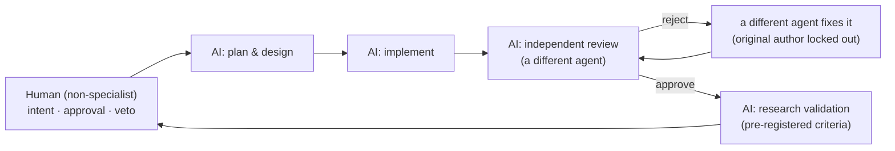

# Part 5 — Lessons: Working with AI on a Technical System

[Series Home (English)](../README.md) | [한국어 README](../README_kokr.md) | [이 문서 한국어](../ko-kr/part5_lessons_for_working_with_ai.md)

> *Series: Building an Algorithmic Trading System as an Investing Novice, with an AI Team (Part 5 of 5)*
>
> **Scope and limits.** Every figure in this series is realized PnL from an Alpaca paper account,
> single window. This part draws the methodological lessons from those very limits.

---

## Summary

- What building a trading system with AI taught a non-specialist was less "with AI you can build
  anything" and more "building it well is not the same as reaching the goal."
- Four lessons: ① even a non-specialist investor, using AI well, can build a mechanical stock-trading
  program, ② for development productivity and consistency you must adopt multi-agent (harness)
  collaboration-and-review techniques, ③ use memory to stop the same bugs from recurring, ④ a program
  running as intended does not mean the goal was met — a domain expert's design must come first.
- For decision-makers: AI produces answers quickly, but judging whether that output meets the real
  objective, and designing for it, remains a human responsibility.

---

## 1. The loop is for development, not trading

The project was built by one person, with an AI team of separated roles. The loop develops and
validates the algorithmic program; live trading is run by the finished code, not by the agents.

The key property is that **the same agent does not both build and review**. The implementing agent,
the reviewing agent, and the research-validation agent are independent — the same principle as "an
author cannot approve their own pull request." The largest risk of an AI team is an echo chamber:
if one model writes optimistic code, the same model approves the optimism. Enforcing reviewer
independence — original author locked out on rejection — is the structural defense.

---

## 2. The four lessons

### Lesson ① Even a non-specialist investor, using AI well, can build a mechanical trading program

InvestIQ was started by a stock/quant non-specialist and grew into a complete automated trading
program — from data ingestion through symbol selection, portfolio optimization, and order execution.
The AI team filled the gap of expert knowledge: the non-specialist decided "what is wanted" and
"what to approve," while the AI filled in the implementation detail. The first lesson is that, used
well, AI lets a single non-specialist build the kind of mechanical system that used to require a team.

### Lesson ② You must adopt multi-agent (harness) collaboration and review

For development productivity and consistency, do not rely on a single agent; you must adopt a
structure (a harness) in which several agents with separated roles collaborate and review each
other's work. As seen in Section 1, separating the implementing agent, the reviewing agent, and the
validation agent prevents the echo chamber where "an author approves their own work." Compared with
using a single agent alone, having multiple agents cross-check in distinct roles produces more
precise, more consistent results.

### Lesson ③ Use memory to stop the same bugs from recurring

Working with AI, the same class of bug tends to come back (the unit-conversion bug and the
`sell_short` bug in Part 4 are exactly such cases). To prevent this you need a memory structure that
"remembers" the work done and the mistakes already made. Actively using the various open-source tools
that record and recall work history, decisions, and bug history — so the same mistake is not repeated
twice — is strongly recommended.

### Lesson ④ Running as intended does not mean the goal was met — a domain expert's design must come first

A program being well-built and running as designed does not mean it achieved its real goal.
InvestIQ's purpose was to generate profit, but the actual result was a loss. So while building with
AI can produce a "well-functioning system," there is no guarantee it leads to a "successful project."
The closing lesson of this experiment is that, whatever the goal, a domain expert's design must come
first before entering AI-driven implementation.

---

The throughline of the series: the value this experiment leaves behind was not a profitable strategy
— the realized result was a near-break-even loss — but the demonstration that a non-specialist, with
an AI team, can build a precise system, and at the same time that such a system reaching its goal
still requires a domain expert's design to come first.

