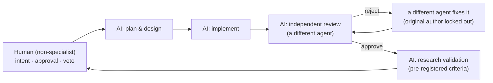

# Part 5 — Lessons: Working with AI on a Technical System

[Series Home (English)](../README.md) | [한국어 README](../README_kokr.md) | [이 문서 한국어](../ko-kr/part5_lessons_for_working_with_ai.md)

> *Series: Building an Algorithmic Trading System as an Investing Novice, with an AI Team (Part 5 of 5)*
>
> **Scope and limits.** Every figure in this series is realized PnL from an Alpaca paper account,
> single window. This part draws the methodological lessons from those very limits.

---

## Summary

- What building a trading system with AI taught a non-specialist was less how to find alpha and more
  how not to fool oneself.
- Five lessons: ① lock criteria before seeing results (pre-registration), ② trust the authoritative
  record over the convenient one, ③ separate the analysis universe from the trading universe,
  ④ hard-code your hard caps, ⑤ build a veto into the automated pipeline.
- For decision-makers: AI produces answers quickly, but designing the structure that can be wrong —
  and that catches itself — remains a human responsibility.

---

## 1. The loop is for development, not trading

The project was built by one person, with an AI team of separated roles. The loop develops and
validates the algorithmic program; live trading is run by the finished code, not by the agents.

The key property is that **the same agent does not both build and review**. The implementing agent,
the reviewing agent, and the research-validation agent are independent — the same principle as "an
author cannot approve their own pull request." The largest risk of an AI team is an echo chamber:
if one model writes optimistic code, the same model approves the optimism. Enforcing reviewer
independence — original author locked out on rejection — is the structural defense.

---

## 2. The five lessons

### Lesson ① Lock your criteria before seeing the results

The news study (Part 4) fixed its hypotheses, tests, and acceptance criteria in a document before
the data was examined (pre-registration). Because the criteria were locked, the honest outcome
— a directionally consistent but **underpowered, unconfirmed** signal — could be reported without
moving the goalposts. AI tries many hypotheses quickly; without pre-registration it will eventually
find something that looks good by chance, and that artifact will be mistaken for a discovery.

### Lesson ② Trust the authoritative record over the convenient one

The local event journal recorded that orders were sent but not the prices they filled at. The
convenient local data was incomplete. The resolution was to go to the **broker's own filled-order
record** — the Alpaca API returns the actual fills — and rebuild the loss analysis on it. The
lesson: a convenient local log is not the source of truth. When a local artifact and the
authoritative system disagree, build on the authoritative one.

### Lesson ③ Separate the analysis universe from the trading universe

News mentions thousands of strings; few resolve to tradable tickers. The rebuilt study scoped its
universe to the **symbols actually traded**, keeping the analysis aligned to real decisions and
avoiding the selection bias of mixing a wide inference universe with a narrow trading one. "Symbols
usable for analysis" and "symbols you may actually hold" are different populations.

### Lesson ④ Hard-code your hard caps

Part 4 showed the entire period loss came from a single-name tail (ASTH, larger than the whole net
result). The defense is structural: a per-name realized-loss cap and exposure ceiling, enforced on
the execution path, not expressed as a soft penalty in an optimizer's objective. An optimizer does
whatever is not explicitly blocked.

### Lesson ⑤ Build a veto into the automated pipeline

In a system that is automated end to end, the veto must live in **code**, not in a human click. HMAC
tokens, fail-closed defaults, and per-name hard caps exercise the veto at the one step where money
moves. The human controls only the switches above it — the kill switch and the live-capital arming —
not individual orders. Full automation is not the danger; **automation without a veto** is.

---

## 3. A practical checklist

| Stage | Question | The trap |
|---|---|---|
| Hypothesis | Were the criteria written before seeing the data? | Changing the hypothesis after seeing results (HARKing) |
| Data | Is this the authoritative record or a convenient copy? | Trusting an incomplete local log |
| Universe | Is the analysis set the same as the trading set? | Selection bias from mixing the two |
| Sizing | Are caps hard constraints on the execution path? | Trusting the optimizer to self-diversify |
| Execution | Is there a veto at the step where money moves? | Automation where money moves with no coded veto |

The throughline of the series: the value was not a profitable strategy — the realized result was a
near-break-even loss — but a **repeatable method for being honestly wrong**. For a non-specialist,
that method, enforced through an AI team that checks itself, is the durable output.

