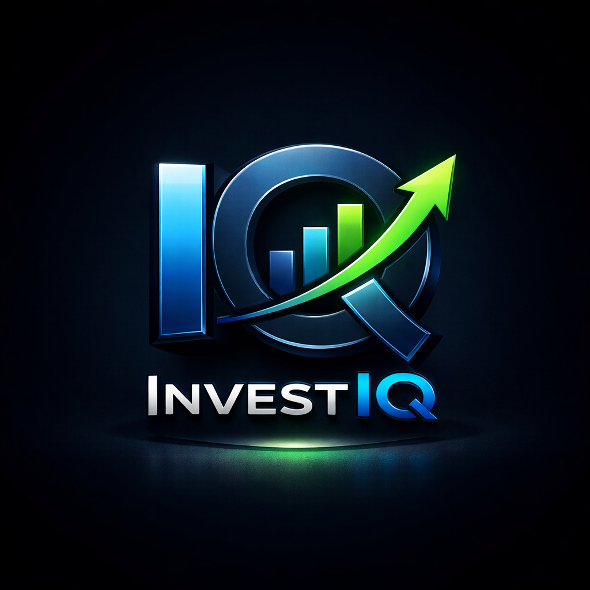

# 한국어 시리즈

  
  한국어 · 5부작
  <h1 class="iq-title">AI 팀과 함께 만든 트레이딩 시스템</h1>
  
투자 비전문가가 LLM 기반 AI 팀과 함께 만든 end-to-end 알고리즘 트레이딩 시스템을 <strong>정직하게</strong> 분석한 기록. 왼쪽 사이드바로 이동하거나 아래에서 편을 선택하세요.

  

    <a class="iq-btn iq-btn-ghost" href="../en-us/">View in English →</a>
  

| # | 제목 | 한 줄 요약 |
|---|---|---|
| 1 | [배경 — 왜, 누가, 무엇으로](part1_background_and_setup.md) | 비전문가 + AI 팀 + 14개 마이크로서비스 페이퍼 MVP |
| 2.1 | [데이터 — 수집 파이프라인과 진실의 원천](part2_1_data_pipeline.md) | 멀티소스 수집 · 단일 Alpaca 가격 소스 |
| 2.2 | [유니버스 선택 — InvestIQ는 무엇을 거래하는가](part2_2_universe_selection.md) | watchlist-intel: 측이 박힌 발괴→승격→로테이션 파이프라인 |
| 2.3 | [대조군 비교와 전략적 방향](part2_3_control_comparison.md) | 백테스트 분해 · 거래군 vs 대조군 · placebo 윈도우 · 이중차분 |
| 3.1 | [전략 — 종목 점수 매기기 (Spec-070)](part3_1_scoring.md) | 컴포지트 점수: 모멘텀/기술 + 뉴스 감성 |
| 3.2 | [Post-Market 파이프라인과 포트폴리오 최적화](part3_2_postmarket_pipeline.md) | Markowitz / Risk Parity · 품질 게이트 · 집중도 캡 |
| 3.3 | [실제 할당, 한 줄씩 읽기](part3_3_real_allocation_example.md) | 실제 2026-06-12 리밸런싱 플랜 |
| 3.4 | [플랜에서 주문으로 — 자동 실행과 코드 거부권](part3_4_approval_gated_execution.md) | 자동 제안 → 자동 실행 · risk-engine HMAC · fail-closed 거부권 |
| 4 | [손실의 실체 — 인과적 해석](part4_loss_attribution.md) | 927 라운드트립 −$369.85 · 단일 종목 테일(ASTH) |
| 5 | [교훈 — AI와 함께 일하기](part5_lessons_for_working_with_ai.md) | 사전등록 · 권위 있는 기록 · 하드 캡 |
