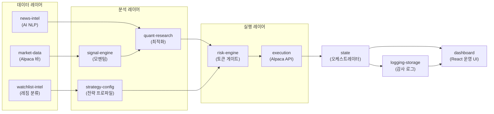
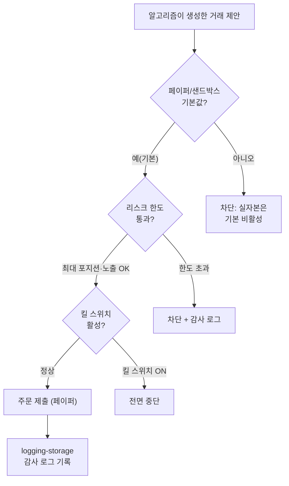

# 1편 — InvestIQ 배경

[시리즈 홈 (한국어)](../README_kokr.md) | [English README](../README.md) | [This page in English](../en-us/part1_background_and_setup.md)

> *Series: 투자 비전문가가 AI 팀과 함께 알고리즘 트레이딩 시스템을 만든 기록 (5편 중 1편)*
>
> **범위와 한계.** 이 시리즈의 모든 수치는 단일 윈도우의 Alpaca **페이퍼** 계정 실현 손익입니다. 검증된
> 실거래 수익이 아닙니다. 시리즈의 가치는 수익이 아니라 과정 — AI의 도움으로 복잡한 시스템을 만들고 그
> 결과를 정직하게 분석한 것 — 에 있습니다.

---

## 요약

- 투자 비전문가가 개발·연구 조직 역할을 하는 LLM 기반 AI 에이전트의 도움으로 **14개 마이크로서비스**로 구성된
  알고리즘 트레이딩 시스템을 만들었습니다.
- 목표는 수익이 아니라 작동하는 end-to-end 자동화 경로 — 뉴스 수집 → 신호 → 포트폴리오 최적화 → 리스크
  게이트 → 주문 실행 — 를 페이퍼 환경에서 안전하게 돌리는 것이었습니다.
- 프로젝트는 **최소한의 예산으로** 전부 페이퍼 계정에서, 고정된 안전 바닥과 함께 진행했습니다. 결과는 작은
  실현 손실이었고, 이를 회계가 아니라 인과로 분석했습니다.

---

## 여기서 "AI"가 하는 일

매매 의사결정은 **코드로 정의된 알고리즘*으로 구체적으로는 기술적 분석 신호, 포트폴리오 최적화, 리스크 규칙이 내립니다.
AI 에이전트의 역할은 비전문가가 그 알고리즘 프로그램을 **개발·연구·리뷰**하도록 돕는 것이지, 실시간으로 종목을
고르거나 주문을 던지는 것이 아닙니다. 시리즈 전반에서 "AI 팀"은 개발 조직을 뜻하고, "제안(proposal)"은 LLM이
아니라 알고리즘 서비스(quant-research 등)가 코드로 생성한 것을 뜻합니다.

---

## 1. 누가 만들었나 — 비전문가와 AI 팀

전제는 단순합니다: 저자는 퀀트가 아닙니다. 포트폴리오 이론, 켈리 공식, 평균회귀 같은 용어는 알지만, 그것을
리스크가 통제된 시스템으로 혼자 옮기는 것은 불가능했습니다.

선택한 접근은 AI 에이전트로 개발·연구 조직을 구성하는 것이었습니다. 내부적으로 "Squad"라 부르는 이 팀은 사람
한 명과 여러 역할의 AI 에이전트로 이뤄집니다.

| 역할 | 책임 |
|---|---|
| 수석 (Product Eng. GM) | 아키텍처 결정, 코드 리뷰, 모듈 간 조율 |
| 소장 (R&D Director) | 연구 방향, 가설 사전등록, 검증 게이트 |
| 퀀트 (Principal Quant) | 신호 설계, 백테스트, 손실 귀인 해석 |
| 데이터 분석가 | EDA, 데이터 프로파일링, 결측·커버리지 점검 |
| 모듈 PM | 각 백엔드 서비스의 제품 책임 |

이 구조는 시리즈의 첫 번째 방법론적 요점을 구현합니다: 비전문가가 AI로 전문 영역에 진입할 때, 에이전트를
답을 돌려주는 신탁이 아니라 **서로를 견제하는 팀**으로 취급하면 상당수의 오류를 조기에 걸러냅니다. 이를
강제하는 구체적 규칙이 있습니다 — 리뷰어가 작업을 거절하면, 원작성자가 아니라 **다른** 에이전트가 수정을
수행합니다. 품질은 합의가 아니라 독립적 리뷰에서 나옵니다.

---

## 2. 무엇을 만들었나 — 14개 마이크로서비스

InvestIQ는 미국 주식 스윙 트레이딩을 **완전 자동**으로 운영합니다: 분석부터 실행까지 무인이며, 돈이
움직이는 단계의 거부권은 사람이 아니라 **코드화된 risk-engine**(HMAC·fail-closed)이 쥡니다. 사람의 유일한
게이트는 주문 단위가 아니라 실자본(live) 모드 무장이며, 기본값은 페이퍼입니다.

각 서비스는 독립적으로 배포되며 Docker Compose로 묶입니다. 핵심 서비스:

| 서비스 | 포트 | 역할 |
|---|---|---|
| market-data | 8012 | Alpaca 일/분봉, provenance 포함 신호 입력 |
| news-intel | 8019 | 멀티소스 뉴스(RSS·Reddit·SEC 8-K) + AI 감성 분석 |
| signal-engine | 8013 | 완성된 일봉에서 BUY/SELL/HOLD 모멘텀 신호 |
| watchlist-intel | 8018 | 심볼 유니버스, DIA/SPY/VIXY 레짐 분류, 프리마켓 스냅샷 |
| quant-research | 8016 | 5단계 품질 게이트 스크리너, Markowitz + Risk Parity 최적화, 백테스트 |
| risk-engine | 8011 | 주문 의도 검증, 포지션/손실 한도, HMAC 승인 토큰 |
| execution | 8014 | Alpaca 주문 제출, 체결 정합성, 실행 리포트 |
| state | 8015 | 마켓 세션 오케스트레이터, 라이프사이클, 제안 엔진 |
| logging-storage | 8010 | append-only 이벤트 로그(JSONL), 거래 로그 |

실행(execution) 서비스는 **fail-closed** 제1원칙을 따릅니다. 즉, risk-engine의 HMAC 토큰 없이는 주문이 제출되지 않습니다.
페이퍼 MVP라도 이 게이트를 먼저 세운 것은 의도적 우선순위입니다. 알고리즘이 생성한 제안을 브로커로
전달하는 지점이 시스템에서 가장 위험한 단계이며, 거부권 레이어는 프로세스가 아니라 코드에 있어야 합니다.

---

## 3. 환경 — 페이퍼 MVP와 안전 바닥

프로젝트는 **최소한의 예산으로**, 모든 거래를 Alpaca **페이퍼(샌드박스)** 계정에서 실행하며 진행했습니다.
빌드를 **비용 대비 효과적으로** 유지하고, 자동화를 다루는 비전문가를 가장 위협하는 실패 양상 — 결함이
의도치 않은 주문을 생성하는 것 — 을 차단하기 위해 처음부터 최소 안전 바닥을 고정했습니다.

안전 바닥:

- **페이퍼/샌드박스가 기본값.** 실자본 옵트인은 기본 비활성.
- **킬 스위치**가 항상 작동.
- **최대 포지션·노출 한도** 강제.
- **서버 사이드 비밀키만** 사용 — 브라우저에 API 키 노출 금지.
- **모든 거래 관련 결정은 감사 로그**로 기록.

안전을 넘어, 페이퍼 환경은 **재현성**에 기여합니다. 실자본은 한 번 일어난 체결을 되돌릴 수 없지만, 페이퍼는
같은 전략을 다시 돌려 원인과 우연을 분리할 수 있습니다. 이 속성이 4편의 인과적 손실 분석을 가능하게 했습니다.

