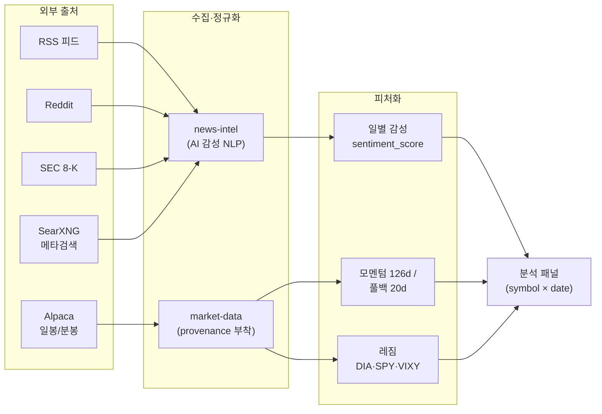
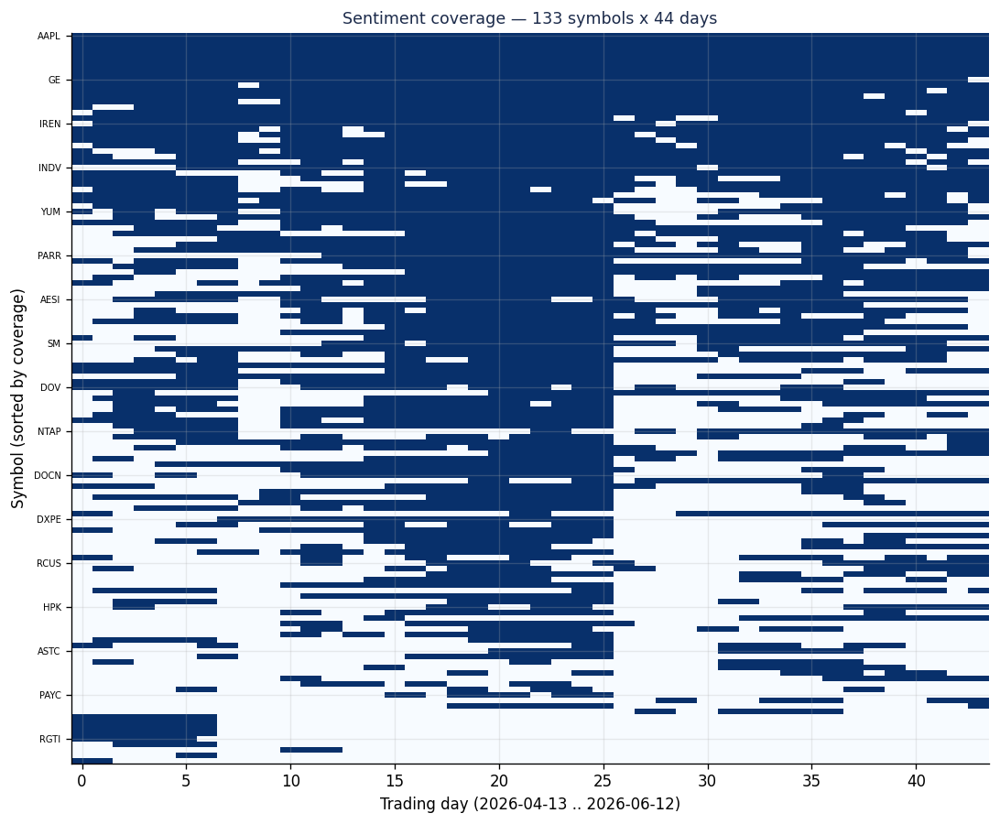

# 2.1편 — 데이터: 수집 파이프라인과 진실의 원천

[시리즈 홈 (한국어)](../README_kokr.md) | [English README](../README.md) | [This page in English](../en-us/part2_1_data_pipeline.md)

> *Series: 투자 비전문가가 AI 팀과 함께 알고리즘 트레이딩 시스템을 만든 기록 (5편 중 2.1편)*
>
> **범위와 한계.** 모든 성과 수치는 단일 윈도우의 Alpaca 페이퍼 계정 실현 손익입니다. 이 소단원은 데이터
> 출처와 검증 — 숫자가 어디서 오고 그것이 실제임을 어떻게 확인했는가 — 를 다룹니다. 2.2편은 유니버스가
> 어떻게 선택됐는지, 2.3편은 그 선택이 대조군 대비 무엇을 의미하는지 검정합니다.

---

## 요약

- 시스템은 다중 출처에서 수집합니다: Alpaca에서 주식 가격, 그리고 news-intel이 종목별 감성으로 가공하는 멀티소스
  뉴스(RSS, Reddit, 등).
- 모든 가격은 거래를 실행한 동일 브로커 Alpaca에서 옵니다. 분석 경로에 제3자 가격 벤더가 없으며, 출처와
  실행을 하나의 소스로 유지합니다.
- 핵심 데이터 교훈: 로컬 이벤트 저널은 주문이 *전송됐다*는 것은 기록했지만 *체결 가격*은 기록하지 않았습니다.
  해법은 브로커 자체 기록으로 이동하는 것 — Alpaca 체결 주문 API가 실제 체결을 반환하며, 4편 손실 분석의
  기반이되는 근거입니다.

---

## 1. 무엇을 모았나 — 수집 파이프라인

- **가격(market-data):** Alpaca의 일/분봉에 각각 **provenance**(출처·시각)를 부착합니다. 숫자가 언제,
  어디서 왔는지 추적할 수 없으면 손실을 사후에 감사할 수 없습니다.
- **뉴스(news-intel):** RSS·Reddit·SEC 8-K를 모아 AI NLP로 종목별 감성을 산출합니다.
- **레짐(watchlist-intel):** DIA·SPY·VIXY 프록시로 시장 국면을 분류합니다.

provenance는 가장 간과하기 쉬운 부분입니다. "애플 종가 195달러"는 정보가 아니라 "2026-03-27 장마감 Alpaca
조정종가 195.32달러"가 정보입니다. 출처와 시각이 빠지면, 나중에 신호가 미래 데이터를 미리 봤다(lookahead)는
의심을 깔끔하게 해소할 수 없습니다.

---

## 2. 단일 가격 소스: Alpaca

의도적 설계 선택은 **분석의 모든 가격을 Alpaca Market Data에서** 가져온다는 것입니다 — 거래를 실행한 동일
계정입니다. 하위 연구들은 외부 가격 제공자가 아니라 Alpaca 마켓데이터 엔드포인트에서 직접 조정 일봉을
가져옵니다.

실행과 분석을 하나의 가격 소스로 유지하면 한 부류의 정합성 오류가 사라집니다: 전략을 평가하는 데 쓰는 가격이
브로커 자신이 보고하는 가격입니다. 또한 provenance 체인을 짧게 유지합니다 — 하나의 벤더, 하나의 시각 규약,
하나의 조정 방식.

---

## 3. 커버리지와 희소성

*그림. 44거래일에 걸친 133종목 거래 유니버스의 종목 × 날짜 감성 커버리지. 채워진 셀은 감성분석이 있다는 의미입니다. 
흰색 빈 공간이 많다는 것은 종목별 뉴스는 종목에 따라 다르지만 대부분 희소합니다.*

*그림. 하루 지연된 일별 뉴스 감성의 분포. 상당수 종목 뉴스는 중립(0) 감성을 가집니다.
대부분의 종목에는 의미 있는 뉴스가 없습니다.*

뉴스가 희소하므로 설계는 감성을 주된 수익 동인이 아니라 여러 입력 중 하나로 취급합니다. 신호가 희소할 때
과도한 가중치는 잡음을 증폭합니다. 적절한 역할은 필터 또는 오버레이이며, 3편의 컴포지트 점수가 감성을 쓰는
방식이 바로 그것입니다.

---

## 4. 진실의 원천: 브로커의 체결 주문 기록

손실 분석은 브로커 자체의 **체결 주문 기록** 위에 구축됩니다. **Alpaca 체결 주문 API**가 실제 체결을
반환합니다: 이 실험에서는 2026-04-13 ~ 2026-06-13 동안 주문 866건, 체결 742건, 개별 체결 1,314건. 그 체결을
FIFO(먼저 산 주식을 먼저 판 것으로 짝지는 방식)로 라운드트립(사서 팔아 한 바퀴를 마감한 거래)에 매칭해 4편이
분석하는 실현 손익 — **927건의 마감 라운드트립에서 −$369.85** — 을 얻었습니다.

| 데이터 항목 | 결과 |
|---|---|
| 진실의 원천 | Alpaca 체결 주문 기록(주문 + 계정 활동) |
| 주문 / 체결 / 체결 명세 | 866 / 742 / 1,314 |
| 마감 롱 라운드트립(FIFO) | 927 |
| 실현 손익 | −$369.85 |

원칙: 브로커의 체결 주문 이력이 권위 있는 기록이며, 손실 분석은 그 위에 직접 구축됩니다. 남은 하나의 공백 —
아직 라운드트립으로 마감되지 않은 22건의 숏 체결 — 은 덮지 않고 명시·제외했습니다.

> **다음:** 2.2편은 "무엇을 모았나"에서 더 날카로운 질문 — **애초에 어떤 종목이 거래 유니버스에 들어왔나**,
> 그리고 외견상 성과의 얼마가 일상 신호가 아니라 그 선택에 있는가 — 로 넘어갑니다.

