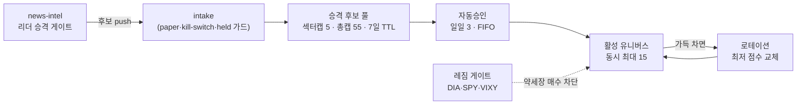
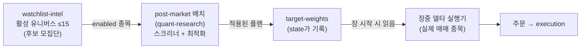

# 2.2편 — 유니버스 선택: InvestIQ는 무엇을 거래할지 어떻게 정하는가

[시리즈 홈 (한국어)](../README_kokr.md) | [English README](../README.md) | [This page in English](../en-us/part2_2_universe_selection.md)

> *Series: 투자 비전문가가 AI 팀과 함께 알고리즘 트레이딩 시스템을 만든 기록 (5편 중 2.2편)*
>
> **범위와 한계.** 단일 윈도우의 Alpaca 페이퍼 계정 실현·백테스트 수치입니다. 이 소단원은 InvestIQ가
> **거래 유니버스를 실제로 어떻게 구성하는지** — 발굴 → 승격 → 활성 유니버스 → 로테이션 → 레짐 게이트 —
> 코드로 검증한 메커니즘을 설명하고, 그 결과로 나온 거래 집합을 보입니다. 그 선택이 진짜 스킬을 갖는지는
> 2.3편이 대조군으로 검정합니다.

---

## 요약

- "무엇을 거래할 것인가"는 InvestIQ에서 **watchlist-intel** 서비스가 가진 단일 권한입니다. 자유 재량이 아니라
  **캡이 박힌 규칙 파이프라인**으로 종목을 받아들이고 내보냅니다.
- 흐름은 **발굴(news-intel) → 승격 후보 풀 → 자동승인 → 활성 유니버스(동시 최대 15) → 로테이션**이며,
  모든 단계에 하드 캡이 있습니다: 일일 자동승인 **3**, 섹터 **5**, 후보 풀 총 **55**, 활성 **15**.
- 그 위에 **레짐 게이트**(DIA·SPY·VIXY 프록시)가 약세장에서 신규 매수를 차단합니다.
- 활성 유니버스가 동시 15종목으로 캡되어 있으므로, 44일 윈도우 동안 파이프라인이 회전시키며 **누적 거래한
  종목이 133개**입니다 — 이것이 2.3·4편 분석의 모집단입니다.

---

## 1. 유니버스는 권한 서비스가 관리한다

InvestIQ에서 거래 유니버스는 어딘가에 흩어진 설정값이 아니라 **watchlist-intel**(8018)이라는 한 서비스의
권한입니다. 이 서비스가 종목을 받아들이고, 활성화하고, 내보내는 유일한 경로이며, 시장 레짐도 여기서
분류합니다. 핵심은 사람이나 LLM의 재량이 아니라 **코드에 박힌 규칙과 캡**으로 동작한다는 점입니다.

아래에서 각 단계를 코드로 검증한 규칙 그대로 따라갑니다.

---

## 2. 발굴 — news-intel 리더 승격 게이트

후보는 news-intel에서 출발합니다. 멀티소스 뉴스(2.1편)에서 종목별로 **리더 점수**와 **감성 점수**를 누적하고,
각각을 EWMA z-점수로 만들어 컴포지트를 계산합니다:

$$\text{composite} = 0.6 \times z_{\text{ewma}}(\text{leader}) + 0.4 \times z_{\text{ewma}}(\text{sentiment})$$

그리고 **교차섹션 80% 규칙**을 적용합니다 — 그날 후보 코호트의 상위 5분위(80퍼센타일)에 들어야 통과합니다.
역사가 짧을 때를 위한 워밍업 폴백도 코드에 있습니다:

| 보유 이력 n | 동작 |
|---|---|
| n < 5 | 전부 거부(`warmup_zero`) |
| 5 ≤ n < 10 | 코호트 p80 대신 고정 z ≥ 1.0 |
| 10 ≤ n < 20 | 표준 p80, 단 일일 캡 3 → 2로 축소 |
| n ≥ 20 | 표준 |

별도 경로로 **섹터 트렌드 자동등록**도 있습니다: 14일 창에서 양(긍정)의 모멘텀 섹터에 속하면서
양(긍정)의 감성 일수가 임계치를 넘는 종목을 후보로 올립니다. 즉 발굴 자체가 **모멘텀과 감성이 동시에 좋은 종목**을
향해 편향되어 있습니다 — 2.3편이 검정할 선택 효과의 출발점입니다.

---

## 3. 승격 — 조건에따른 자동승인

발굴된 후보는 watchlist-intel의 **intake** 엔드포인트로 push되어 후보 풀에 들어갑니다.
여기서부터 안전 가드와 하드 캡이 작동합니다:

- **paper-only · kill-switch 가드:** 페이퍼 계정이 아니거나 킬 스위치가 켜져 있으면 intake 자체를 거부(503).
- **보유 종목 보호:** 이미 보유 중인 종목은 다시 후보로 받지 않습니다 — 단, 재활성 점수가 0.75 이상이면 예외.
- **섹터 캡 5 · 총 캡 55:** 한 섹터 5개, 풀 전체 55개를 넘으면 `rejected_cap`. 후보는 **7일 TTL** pending으로
  보관됩니다.

후보를 거치지 않는 자동 승인은 별도의 **자동승인** 단계가 합니다(`auto_approve_pending`):

- **UTC 거래일당 최대 3건**(`DAILY_AUTO_CAP`)을 **FIFO**(먼저 발굴된 순)로 승인합니다.
- 매 실행마다 paper-only, kill-switch, 리밸런싱 락, state 도달 가능(보유 종목 조회) 가드를 다시 통과해야 하며,
  하나라도 막히면 그날 자동승인을 통째로 건너뜁니다.
- 승인된 항목은 `reviewedBy = "auto-approve"`로 기록되며, 운영자는 24시간 TTL 내에 사후 검토·거부할 수
  있습니다.

요컨대 "오늘 새로 거래 가능해지는 종목"은 사람의 즉흥 판단이 아니라 **자동 승인은 하루 최대 3개, 11개 섹터당 최대 5(총 55 종목)  한도 안에서, 페이퍼·킬스위치·보유 가드를 통과한** 것들로 구조적으로 제한됩니다.

---

## 4. 활성 유니버스와 로테이션

활성 유니버스는 동시 **최대 15종목**으로 캡됩니다. 이 점수 계산과 로테이션은 별도 배치가 아니라 **프리마켓
스냅샷 발행 사이클**(장전, 04:00·08:35 ET) 안에서 일어납니다 — 스냅샷을 만들기 직전 자동승인이 돌고, 새
종목을 넣는데 이미 15개가 차 있으면 그 자리에서 **로테이션**을 트리거해 가장 약한 종목을 내보냅니다. 뉴스
파이프라인이나 야간 post-market 배치와는 무관합니다.

로테이션 점수는 20일 창에서 두 신호를 **활성 종목들 사이에서 `[0,1]`로 정규화한 뒤** 가중합합니다:

$$\text{rotation} = 0.6 \times \widehat{\text{buy\_freq}} + 0.4 \times \widehat{\text{realized\_pnl}}$$

- **buy_freq:** watchlist-intel 자신이 보관한 최근 프리마켓 스냅샷들에서 그 종목이 `buy` 추천을 받은 일수
  비율. 이 추천은 뉴스 감성이 아니라 **기술 지표**(추세·모멘텀·데이터 신선도)로 산출됩니다.
- **realized_pnl:** logging-storage의 체결 리포트에서 20일 창에 누적한 **실현 손익(달러 PnL)** — 수익률이
  아닙니다.
- 최소 활성 10일을 채우고 미체결 포지션이 없어야 교체 대상이 되며(가드), 정규화 후 최저 점수 종목이
  빠집니다.

둘 다 `[0,1]` 상대 순위라, 로테이션은 절대 성과가 아니라 **현재 활성 종목들 안에서의 상대적 약함**을
기준으로 합니다. 이 캡 + 로테이션 구조 때문에 활성 유니버스는 항상 작고(≤15), 시간이 지나며 **누적 거래
종목 수는 그보다 훨씬 커집니다** — 좋은 종목이 들어오고 약한 종목이 빠지기 때문입니다.

---

## 5. 레짐 게이트 — 언제 사느냐의 상위 스위치

종목 선택 위에는 시장 전체 국면 스위치가 있습니다. watchlist-intel은 DIA·SPY·VIXY 프록시로 레짐을
분류합니다:

| 레짐 | 평균 모멘텀 임계 | 효과 |
|---|---|---|
| Strong Bull | ≥ +3.0 | 정상 참여 |
| Mild Bull | ≥ +1.0 | 정상 참여 |
| Neutral | (사이) | 참여율 하향 |
| Mild Bear | < −1.0 | **신규 매수 차단** |
| Severe Bear | < −3.0 | **신규 매수 차단 + 방어** |

VIXY는 3일 평균 변화율과 5일 모멘텀으로 위험 방향(`rising-risk`·`stabilizing`·`neutral`)을 추가 해석하고,
레짐별로 참여율·손절·익절 배수가 달라집니다. 즉 종목 단의 발굴·승격이 통과해도, **약세 레짐에서는 신규 매수
자체가 막힙니다** — 유니버스 선택의 마지막 게이트입니다.

---

## 6. 이 유니버스는 직접 매매되지 않는다 — 후보 vs 실제 매매

중요한 구분: watchlist-intel의 활성 유니버스는 **무엇을 "고려"할지**를 정할 뿐, 그 자체로 매매를 트리거하지
않습니다. 실제 장중 매매 종목은 두 단계를 더 거칩니다.

- **후보 모집단 (watchlist-intel):** 활성 워치리스트 + 보유 + 승격 후보 + 벤치마크가 post-market 배치의
  **입력 유니버스**가 됩니다.
- **실제 타깃 (post-market, 3.2편):** 야간 배치가 그 유니버스로 포트폴리오 비중을 최적화하고, state가 이를
  **target-weights**로 기록합니다 — 이것이 정식 핸드오프 지점입니다.
- **장중 실행:** 장 시작 시 실행기가 그 target-weights를 읽어 **현재 보유와의 차이(델타)**만큼만 주문합니다.
  장중에 새 종목을 발굴하지 않습니다.

한 줄로: watchlist-intel은 "출전 명단", post-market 최적화는 "선발 라인업과 비중", 장중 실행기는 그 라인업
대비 보유 차이를 메우는 주문입니다.

---

## 7. 그래서 결과는 — 133종목

이 파이프라인을 44거래일 동안 돌린 결과가 **시스템이 실제 거래한 133종목**입니다(범위 외 2개 제외). 활성
유니버스가 동시 15로 캡되어 있으므로 133은 한 시점의 보유가 아니라, 발굴→승격→로테이션이 회전시키며 **윈도우
전체에 걸쳐 누적된** 거래 집합입니다. 이 133종목이 2.3편 대조군 검정과 4편 손실 분석의 모집단입니다.

여기서 중요한 성질 하나: 이 133종목은 **무작위 표본이 아닙니다.** 발굴 단계가 모멘텀·감성이 좋은 종목으로
편향되어 있고(2절), 약세장에서는 신규 진입이 막히며(5절), 약한 종목은 로테이션으로 빠집니다(4절). 그래서 이
집합은 구조적으로 "활발하고 센티멘트·모멘텀이 높은 소/중형주"로 기울어 있습니다.

이것이 다음 편을 위한 정확한 질문을 세웁니다: 이렇게 고른 유니버스가 지수를 이길 때, 그것은 **고른 스킬**인가,
아니면 **이미 오르고 있던 종목을 올라탄 것**인가? 인샘플에서 거래 종목만으로는 둘을 구분할 수 없습니다.

> **다음:** 2.3편은 먼저 "감성 정렬 → N일 보유" 백테스트를 분해해 외견상 엣지의 대부분이 일상 신호가 아니라
> **선택 단계**에 있음을 보이고, 이어서 비거래 종목 대조군과 거래 이전 placebo 윈도우로 그 선택이 진짜 사전적
> 스킬을 갖는지 — 아니면 기존 모멘텀을 올라탄 것인지 — 를 직접 검정합니다.

