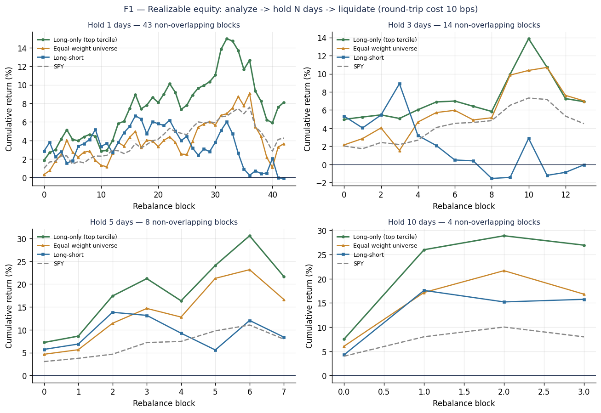
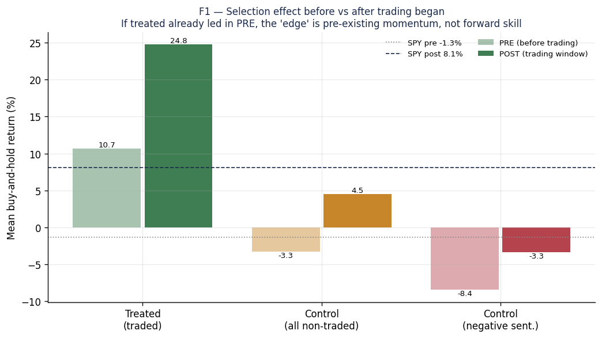

# 2.3편 — 유니버스 후보 종목과 탈락 종목의 비교

[시리즈 홈 (한국어)](../README_kokr.md) | [English README](../README.md) | [This page in English](../en-us/part2_3_control_comparison.md)

> *Series: 투자 비전문가가 AI 팀과 함께 알고리즘 트레이딩 시스템을 만든 기록 (5편 중 2.3편)*
>
> **범위와 한계.** Alpaca 페이퍼 계정 데이터를 이용한 유사실험이며, 단일 윈도우의 결과입니다. 이 장은 먼저
> 백테스트를 분해하여 겉으로 드러난 성과의 대부분이 2.2편에서 설명한 유니버스 선택 단계에서 비롯됨을 보입니다.
> 이어 그 선택이 실제로 사전적 예측력을 갖는지를 비거래 종목 대조군과 placebo 윈도우로 검정하고, 그 결과에서
> 따라오는 전략적 방향을 정리합니다.

---

## 요약

- 감성으로 정렬한 뒤 N일 보유하는 백테스트를 분해해 보면, 겉으로 드러난 성과의 대부분은 매일의 신호가 아니라
  2.2편에서 설명한 선택 단계, 곧 애초에 어떤 종목이 유니버스에 포함되었는가에서 비롯됩니다.
- 선택된 후보군이 의미를 갖는지 확인하기 위해 대조군을 구성하였습니다. 뉴스 파이프라인이 포착했으나 시스템이
  실제로 거래하지 않은 종목으로 이루어지며, 의도적으로 부정적 감성을 가진 종목 집합도 포함합니다. 이들을 거래
  윈도우와 거래 시작 이전 44일에 걸쳐 거래 종목과 비교하였습니다.
- 거래군은 거래 윈도우에서 대조군을 큰 폭으로 앞섬으나(+20pp), 거래를 시작하기 이전에 이미 +14pp를 앞서
  있었습니다. 추세를 제거한 이중차분 추정치는 통계적으로 유의하지 않았습니다.
- 결론적으로, 선택된 종목은 대체로 이미 존재하던 모멘텀에 올라탄 것이지 그것을 예측한 것은 아닙니다. 다만 주식을
  잘 모르는 비전문가가 뉴스 감성과 몇 가지 규칙만으로 구성한 후보군이 시장이 실제로 주목한 모멘텀 종목들로
  채워졌다는 사실 자체는 단순한 우연으로 보기 어렵습니다. 이 결과는 유의미함과 무의미함의 중간에 놓여 있습니다.

---

## 1. 겉으로 드러난 성과는 선택 단계에서 나온다

2.2편에서 InvestIQ가 모멘텀과 감성으로 편향된 작은 유니버스를 선택한다는 점을 확인하였습니다. 그렇다면 그
유니버스를 대상으로 독자가 흔히 떠올릴 법한 전략을 실행하면 성과가 어떻게 보일지 살펴봅니다. 곧 뉴스만으로
유망한 종목을 자동으로 탐지하여 투자 수익을 만들어 내는 전략입니다. 이를 평가하기 위해 거래비용을 포함한
시뮬레이션을 수행하였습니다. 매일 유니버스를 하루 지연된 감성으로 정렬하고, 상위 3분의 1을 매수하여 N일 동안
보유한 뒤 청산하고, 다시 구성하는 절차를 반복하였습니다.

| 보유 | 롱온리 | SPY | 거래당 NW t | 적중률 |
|---|---:|---:|---:|---:|
| 1d | +8.1% | +4.2% | 0.98 | 65% |
| 3d | +6.9% | +4.5% | 1.88 | 68% |
| 5d | +21.7% | +8.0% | 1.84 | 77% |
| 10d | +26.9% | +8.0% | **2.61** | 82% |


*그림. 구성에서 N일 보유를 거쳐 청산에 이르는 실현 가능 자산곡선이며 거래비용 10bps를 반영하였습니다. 롱온리(초록)가
모든 보유 구간에서 SPY(회색 점선)를 웃돌지만, 주황색 선을 함께 살펴볼 필요가 있다.*

표면적으로 10일 보유 결과는 SPY 대비 +27% 대 +8%, 거래당 t값 2.61로 작동하는 전략처럼 보입니다. 그러나 성과를
분해하면 그 해석은 유지되지 않습니다. 감성 신호의 기여를 유니버스 자체의 표류와 시장 베타로부터 분리하기 위해,
133종목을 동일 비중으로 보유하는 유니버스 동일가중 벤치마크와 상위 3분의 1을 매수하고 하위 3분의 1을 매도하는
시장중립 롱숏을 함께 비교합니다.

| 보유 | 롱온리 | 동일가중 유니버스 | **선택 알파** | 롱숏 (신호만) |
|---|---:|---:|---:|---:|
| 1d | +8.1% | +3.6% | +4.5% | −0.1% |
| 3d | +6.9% | +7.0% | **−0.1%** | −0.0% |
| 5d | +21.7% | +16.7% | +5.0% | +8.4% |
| 10d | +26.9% | +16.8% | +10.1% | +15.7% |

두 가지 사실이 두드러집니다. 첫째, 133종목 유니버스 자체가 SPY를 앞섬습니다(10일 기준 +16.8% 대 +8.0%). 감성에 따른
선택이 없더라도 이 소형주·중형주 유니버스가 지수보다 더 올랐기 때문입니다. 둘째, 매일의 신호가 더하는 기여는
작고 일관되지 않습니다. 선택 알파는 사전등록한 3일 구간에서 0이고, 시장중립 롱숏은 10일 구간에서 거래당 −3.8%로
음수입니다.

```
롱온리 총수익  =  시장(SPY)  +  유니버스 선택  +  매일의 신호
   +27%       ≈    +8%      +    +17% (최대)   +    ~0%
```

결국 겉으로 드러난 성과의 대부분은 매일 감성으로 정렬하는 행위가 아니라, 애초에 어떤 종목이 유니버스에
포함되었는가, 곧 2.2편에서 설명한 선택 단계에서 비롯됩니다. 그렇다면 그 선택은 오를 종목을 미리 골라낸 예측력인가,
아니면 이미 오르고 있던 종목을 골라 그 흐름에 올라탄 것인가. 인샘플에서 거래 종목만으로는 두 경우를 구분할 수
없습니다. 이어지는 절에서 대조군을 통해 이 물음에 답합니다.

---

## 2. 설계: 거래군과 대조군, 사전과 사후

이 종목들을 선택한 행위가 예측력을 보였는지 묻기 위해서는, 그 선택이 없었다면 결과가 어떻게 나타났을지를
알아야 합니다. 이를 위해 다음과 같은 유사실험을 설계하였습니다.

- **거래군.** 실제로 거래한 132개 종목.
- **대조군.** 거래하지 않았으나 뉴스가 존재한 종목으로, 넓게는 2,847개이며 그 가운데 부정적 감성을 가진
  1,423개를 별도 집합으로 둡니다. 부정적 감성 집합은 명백히 부정적인 뉴스가 있었으나 거래하지 않은 종목으로,
  대비가 분명한 비교 기준이 됩니다.
- **PRE 윈도우.** 거래를 시작하기 이전 44거래일로, 시스템이 행동하기 전 구간에 해당하는 placebo입니다.
- **POST 윈도우.** 44일의 거래 윈도우 자체.

모든 가격은 외부 벤더 없이 Alpaca Market Data에서 가져왔고, 감성은 InvestIQ news-intel을 사용하였습니다. 설계는
결과를 확인하기 전에 고정하였습니다.

---

## 3. 단순 비교에서는 거래군이 우월해 보인다

거래 윈도우에서 거래 종목은 대조군을 크게 앞섰습니다.

| 그룹 | n | POST 수익 |
|---|---:|---:|
| 거래군 (거래함) | 132 | **+24.8%** |
| 대조군 — 전체 비거래 | 2,847 | +4.5% |
| 대조군 — 부정 센티멘트 | 1,423 | −3.3% |
| SPY | — | +8.1% |

전체 비거래 종목 대비 +20pp의 우위(t = 4.4, p = 2×10⁻⁵)는 상당한 선택 예측력처럼 보입니다. 그러나 placebo
윈도우가 이 해석을 무너뜨립니다. 해당 종목들이 거래되기 이전에 거래군은 이미 큰 폭으로 앞서 있었습니다.

| 그룹 | PRE 수익 |
|---|---:|
| 거래군 (거래함) | **+10.7%** |
| 대조군 — 전체 비거래 | −0.7% |
| 대조군 — 부정 센티멘트 | −8.4% |
| SPY | −1.3% |


*그림. 거래 이전(연한 색)과 거래 중(진한 색)의 평균 매수보유 수익입니다. 거래군의 우위는 이미 PRE 기간에 크게
나타나며, 이는 선택이 기존 모멘텀을 따라갔음을 시사합니다.*

거래 종목은 선택 이전부터 대조군과 동등한 출발선에 있지 않았습니다. 이미 앞서 있던 종목들이었습니다.

---

## 4. 이중차분 분석에서는 유의한 사전적 예측력이 확인되지 않는다

각 그룹의 고정 수준과 기존 추세를 제거한 정직한 추정은 사후 격차에서 사전 격차를 뺀 이중차분(DiD)으로
구합니다.

| 비교 | PRE 갭 | POST 갭 | **DiD** | 부트스트랩 95% CI | p |
|---|---:|---:|---:|---:|---:|
| 거래군 − 전체 비거래 | +14.0pp | +20.3pp | **+6.3pp** | [−3.3, +17.2] | 0.23 |
| 거래군 − 부정 센티멘트 | +19.1pp | +28.1pp | **+9.0pp** | [−0.8, +19.9] | 0.094 |


*그림. 거래군과 대조군의 격차는 거래 이전에 이미 +14pp(전체) 및 +19pp(부정)였고, 거래 중에는 +20pp 및
+28pp로 벌어졌습니다. 그 증분인 DiD는 작고 통계적으로 유의하지 않습니다.*

두 신뢰구간 모두 0을 포함합니다. 사후의 +20.3pp 우위 가운데 +14.0pp, 곧 약 69%가 거래 이전에 이미 존재하였습니다.
기존 추세를 제거하면 선택의 사전적 예측력은 통계적으로 0과 구별되지 않습니다. 선택은 이미 오르고 있던 종목을
포착하였을 뿐, 어느 종목이 오를지를 입증 가능한 수준으로 예측하지는 못하였습니다.

용량-반응(dose-response, 신호가 강할수록 수익도 커지는지) 점검에서는 미래 수익과 윈도우 내 감성 사이에 강한 양의 기울기가
나타납니다. 그러나 이때 감성은 수익과 동일한 윈도우에서 측정되므로, 이는 동시적 동반 움직임일 뽐 예측이 아닙니다. 이 결과는 이중차분
판정과 모순되지 않으며, 그것을 뒤집지도 못합니다.

---

## 5. 선택의 의미: 예측은 아니나 우연도 아니다

앞의 통계가 부정한 것은 정확히 한 가지, 곧 예측입니다. 거래군의 사후 우위 가운데 약 69%는 거래 이전에 이미
존재하였고, 추세를 제거한 이중차분은 0을 기각하지 못합니다. 어느 종목이 오를지 미리 알았다는 주장은 이
데이터로 입증되지 않습니다. 다음 네 가지 한계가 그 주장을 더욱 제약합니다.

1. **선택된 집합은 구성상 지수를 앞섭니다.** 거래가 활발하고 감성과 모멘텀이 높은 소형주·중형주를 선택하면,
   상승장에서 이들은 SPY보다 더 오릅니다. +24.8% 대 +8.1%의 차이는 대부분 팩터 노출에서 비롯된 것이지
   예측력이 아닙니다.
2. **우위의 대부분은 기존 모멘텀입니다.** 비거래 종목 대비 우위의 약 69%가 어떤 거래보다 앞서 존재하였으며,
   이는 유니버스 수준의 사전 정보 유입(look-ahead)에 해당합니다.
3. **인과 추정치는 유의하지 않습니다.** 이중차분은 0을 기각하지 못합니다.
4. **나스닥 전체로 일반화되지 않습니다.** 대조군은 여전히 뉴스가 존재한 종목이지 무작위 표본이 아니므로,
   외적 타당도는 파이프라인이 관측할 수 있었던 종목 범위로 한정됩니다.

그러나 같은 데이터는 다른 한 가지를 분명히 보여줍니다. 통계가 부정한 것은 예측이지 포착이 아닙니다. 거래 이전
PRE 구간에서 거래군은 이미 +10.7%였던 반면, 전체 비거래 대조군은 −0.7%, 명백히 부정적 뉴스를 가진 종목군은
−8.4%였습니다. 파이프라인은 시장이 이미 주목하고 모멘텀이 살아 있던 종목 쪽으로 체계적으로 기울었고, 부정적인
종목은 체계적으로 회피하였습니다.

이 장의 핵심은 여기에 있습니다. 통계적으로 유의하지 않다는 것이 곧 무의미하다는 뜻은 아닙니다. 주식을 잘 모르는
비전문가가 뉴스 감성과 몇 가지 규칙만으로 구성한 후보군이, 비어 있던 관심 종목의 자리를 시장이 실제로
주목하고 모멘텀이 살아 있던 종목들로 채웠다는 사실은 단순한 우연으로 보기 어렵습니다. 그 선택은 어느 종목이
오를지를 예측하지는 못하였으나, 시장의 관심과 모멘텀을 포착하는 데에는 반복 가능한 무언가가 작동하였습니다.
따라서 이 결과는 유의미하다고 단정할 수도, 무의미하다고 치부할 수도 없는 그 중간에 놓여 있습니다.

---

## 6. 전략적 방향

이 발견은 막다른 길이 아니라 방향의 전환입니다. 진짜 성과가 어디에서 나와야 하는지, 그리고 그것을 정직하게
검정하는 방법이 무엇인지를 알려줍니다.

1. **매일의 신호가 아니라 선택을 연구합니다.** 성과는 유니버스 선택에 있으므로, 개선하고 검증할 대상도 바로
   그 선택입니다.
2. **유니버스를 시점 고정(point-in-time)으로 정의합니다.** 각 윈도우가 열리기 전에 고정된 규칙으로 종목을
   선정하여, 이미 일어난 움직임에 올라타지 못하도록 합니다. 이는 현재 결과를 부풀린 유니버스 수준의
   사전 정보 유입을 제거합니다.
3. **항상 대조군을 함께 둡니다.** 거래하지 않은 뉴스 보유 종목과 부정적 감성 집합을 상시 벤치마크로 유지하여,
   앞으로의 모든 주장이 인샘플 서술이 아니라 거래군과 대조군, 사전과 사후를 비교하는 형태가 되게 합니다.
4. **아웃오브샘플로 반복 검증합니다.** 단일 44일 국면만으로는 무엇도 확정할 수 없습니다. 동일한 파이프라인을 다른
   윈도우와 시세에서 다시 실행해야 어떤 선택 규칙이든 신뢰할 수 있습니다.
5. **모멘텀과 예측력을 명시적으로 분리합니다.** 현재의 성과가 대체로 모멘텀에서 비롯되므로, 의미 있는 다음
   실험은 선택이 단순 모멘텀 스크린을 넘어 추가적인 기여를 하는지를 확인하는 것입니다. 만약 그렇지 않다면 뉴스
   기반의 복잡한 장치는 그 복잡성을 정당화하지 못합니다.

따라서 이 프로젝트 결론의 정직한 형태는 재무적이라기보다 방법론적입니다. 비전문가의 뉴스 기반 선택은 시장의
관심과 모멘텀을 포착하는 데에는 분명히 어떤 역할을 하였으나, 그것이 예측력인지를 묻는 측정, 곧 대조군과
placebo 윈도우와 이중차분으로 이루어진 검정에는 아직 그렇다고 답하지 못합니다. 이 연구가 남긴 것은 그 둘을
구분하여 정직하게 검정하는 방법이며, 이는 단일 윈도우의 자산곡선보다 더 오래 남는 성과입니다.


