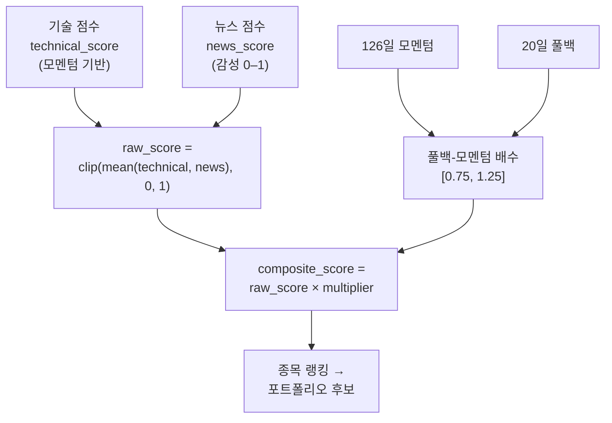

# 3.1편 — 전략: 종목 점수 매기기 (Spec-070 컴포지트)

[시리즈 홈 (한국어)](../README_kokr.md) | [English README](../README.md) | [This page in English](../en-us/part3_1_scoring.md)

> *Series: 투자 비전문가가 AI 팀과 함께 알고리즘 트레이딩 시스템을 만든 기록 (5편 중 3.1편)*
>
> **범위와 한계.** 성과 수치는 단일 윈도우의 Alpaca 페이퍼 계정 실현 손익입니다. 이 소단원은 각 종목에
> 점수를 매기는 방법을 다룹니다; 3.2편은 post-market 파이프라인과 포트폴리오 최적화, 3.3편은 실제 할당
> 예시, 3.4편은 승인 게이트 실행을 다룹니다.

---

## 요약

- 각 종목은 **Spec-070 컴포지트 점수**를 받습니다 — 모멘텀/기술 점수와 뉴스 감성 점수를 혼합하고
  **풀백-모멘텀 배수(0.75–1.25)**를 곱한 값.
- 이 점수가 종목이 포트폴리오 후보가 되는지를 결정하는 단일 숫자입니다.
- 신호는 lookahead를 피하기 위해 **완성된 일봉**에서만 산출됩니다.

---

## 1. 컴포지트 점수

신호는 두 정보를 결합합니다: 가격이 어떻게 움직였는가(모멘텀)와 뉴스가 무엇을 말하는가(감성).

코드로 검증한 정의(`portfolio_optimization_070.py`):

- **raw_score** = `clip(mean([technical_score, news_score]), 0, 1)` — 기본적으로 기술 점수와 뉴스 점수의
  동일 가중 평균.
- **풀백-모멘텀 배수**는 126일 모멘텀과 20일 풀백을 결합해 `[0.75, 1.25]`로 클램핑합니다. 모멘텀 > 0일 때:
  `1 + 0.25 × min(1, mom/0.50) × min(1, pullback/0.15)`. 상승 추세 + 적당한 눌림에서 점수를 높입니다 —
  전형적인 "건강한 눌림목 매수".
- **composite = raw × multiplier.**

설계 가설은 상승 추세에서 약간 눌린 종목을 선호하는 것입니다. 4편에서 보듯 실험 동안 전략의 엣지는
한계적이었고, 가장 유용한 레버는 점수 공식 자체가 아니라 단일 종목 테일 통제였습니다.

별개지만 결정적인 디테일: signal-engine은 **완성된 일봉**에서만 신호를 냅니다. 진행 중인 봉에서 내면
lookahead가 생기며, 이는 백테스트가 비현실적으로 좋아 보이는 가장 흔한 이유입니다.

> **다음:** 3.2편은 이 종목별 점수를 **post-market 파이프라인**으로 가져가, 최적화와 품질 게이트를 거쳐
> 포트폴리오 비중으로 만듭니다.

