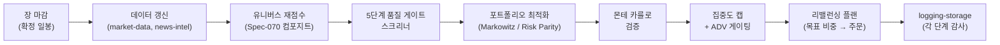
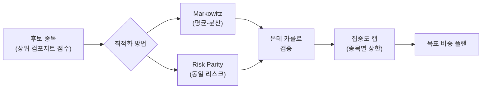

# 3.2편 — Post-Market 파이프라인과 포트폴리오 최적화

[시리즈 홈 (한국어)](../README_kokr.md) | [English README](../README.md) | [This page in English](../en-us/part3_2_postmarket_pipeline.md)

> *Series: 투자 비전문가가 AI 팀과 함께 알고리즘 트레이딩 시스템을 만든 기록 (5편 중 3.2편)*
>
> **범위와 한계.** 페이퍼 계정, 단일 윈도우. 이 소단원은 post-market 배치 파이프라인과 포트폴리오 최적화
> 개념을 다룹니다; 3.3편은 이벤트 로그의 실제 할당을 살펴봅니다.

---

## 요약

- 장 마감 후 **post-market 배치**가 매일 밤 실행됩니다: 데이터 갱신, 유니버스 재점수, 비중 최적화, 다음
  세션을 위한 **리밸런싱 플랜** 생성.
- 비중은 두 최적화기 — **Markowitz(평균-분산)**와 **Risk Parity** — 에서 나와, **5단계 품질 게이트 +
  몬테 카를로** 검증과 **종목별 집중도 캡**을 거칩니다.
- 이것이 종목별 점수를 실제 목표 포트폴리오로 바꾸는 단계입니다.

---

## 1. Post-market 배치 파이프라인

시스템은 봉이 확정되고 장중 압박이 없는 **장 마감 후**에 무거운 사고를 합니다. 매일 밤 배치가 고정된
단계를 진행하며, 각 단계에서 `PostMarketBatchStage.v1` 이벤트를 발생시켜 전체 실행을 감사 가능하게 합니다.

post-market 실행은 비전문가에게 중요합니다: 장중 잡음에 반응하려는 유혹을 제거하고, **완성된** 봉에서
작동하며(lookahead 없음), 그날 밤의 결정을 산발적 거래의 흐름이 아니라 검토 가능한 단일 산출물로 만듭니다.

---

## 2. 왜 최적화인가 — 그리고 집중도의 함정

높은 점수의 종목을 고르는 것은 *무엇을* 보유할지에 답합니다. 최적화는 각각을 *얼마나* 보유할지에 답하며 —
여기서 비전문가가 **집중도**로 가장 크게 다칩니다.

- **Markowitz(평균-분산)**는 기대수익과 공분산 행렬이 주어졌을 때 샤프 비율을 최대화하는 비중을 선택합니다.
  제약이 없으면 위험조정 수익이 가장 좋다고 믿는 소수 종목에 비중을 몰아넣는 경향이 있습니다.
- **Risk Parity**는 대신 각 종목이 **동일한 리스크**를 기여하도록 배분해, 취약한 수익 예측에 의존하지 않는
  더 평탄하고 분산된 북을 만듭니다.
- **5단계 품질 게이트 + 몬테 카를로**는 결과를 신뢰하기 전 시뮬레이션으로 스트레스 테스트합니다.

실제 실패 양상이 여기서 드러났습니다: 종목별 캡이 **실행 경로의 하드 제약**이 아니라 **목적함수의 소프트
페널티**로 표현되면, 최적화기가 단일 종목에 과대한 비중(관측된 한 사례에서는 23% 이상)을 배정할 수
있습니다. 교정책은 하드 종목별 캡 — 기본값 약 15%, 최대 예외 약 20%, 신호 충돌·노후 레짐 구간에서 강화.
원칙: 최적화기는 명시적으로 막지 않은 것은 무엇이든 하므로, 캡은 목적함수가 아니라 산출물에 있어야 합니다.

---

## 3. 산출물: 리밸런싱 플랜

최적화는 주문을 내지 않습니다. **리밸런싱 플랜** — 목표 비중, 목표 주식수, 현재 주식수, 델타, 액션
(매수/매도/보유)의 종목별 표 — 을 생성합니다. 각 항목은 주문 전에 리스크 엔진(3.4편)이 점검합니다.

| 필드 | 의미 |
|---|---|
| `targetWeight` | 최적화기가 원하는 포트폴리오 비중 |
| `currentWeight` | 북이 현재 보유한 비중 |
| `targetShares` / `currentShares` | 비중의 정수 주식수 변환 |
| `deltaShares` | 현재→목표로 이동하는 데 필요한 거래 |
| `action` | 매수 / 매도 / 보유 |
| `riskGateStatus` | 리스크 엔진의 승인 / 차단 / 캡 |

> **다음:** 3.3편은 이벤트 로그에서 실제 리밸런싱 플랜 — 실제 어느 날 밤의 포트폴리오 — 을 열어, 비중·거래·
> 리스크 게이트 결정을 한 줄씩 읽습니다.

