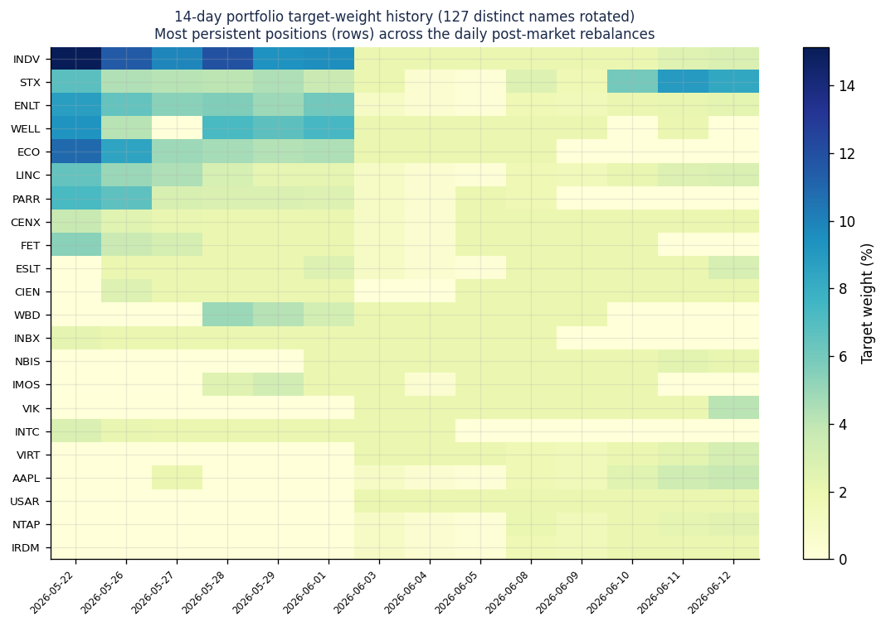

# 3.3편 — 장중 매매

[시리즈 홈 (한국어)](../README_kokr.md) | [English README](../README.md) | [This page in English](../en-us/part3_3_real_allocation_example.md)

> *Series: 투자 비전문가가 AI 팀과 함께 알고리즘 트레이딩 시스템을 만든 기록 (5편 중 3.3편)*
>
> **범위와 한계.** 페이퍼 계정, 단일 윈도우. 이 소단원의 모든 숫자는 InvestIQ 이벤트 로그에서 직접 가져온
> 것입니다 — 가공한 예시가 아니라 실제 post-market 리밸런싱 플랜입니다.

---

## 요약

- 장이 시작되기 전 — **2026-06-12** 리밸런싱 플랜(`rebal-20260613T022809Z`) — 을 열어 실제
  비중·거래·리스크 게이트 결정을 읽습니다.
- 예를 들어 플랜은 **31개 종목**을 보유했고, **상위 5개가 약 35%**, 종목별 목표 비중 상한은 약 10%였으며,
  **매수 16 / 매도 8 / 보유 9**를 생성했고 리스크 엔진이 **3건을 차단**했습니다.
- 이것은 여러가지 규칙을 통해 발굴된 주식 종목별 점수를 실제 포트폴리오로 만들었고, 각 종목별 데이터를 바탕으로
  투자 비율과 액션을 동적으로 계산한 뒤, 리스크 엔진이 안전 바닥을 적용해 최종적으로 거래할 종목과 수량을 결정하는 실제 할당의 예입니다.

---

## 1. 전날 배치 결과

2026-06-12 마감 후 post-market 배치는 33개 항목 플랜을 생성했고, 그중 **31개가 양의 목표 비중**을
가졌습니다. 비중 순:

*그림. 2026-06-12 플랜의 목표 비중, 액션별 색상(초록 매수, 빨강 매도, 파랑 보유). ASX가 9.7%로 선두,
그 뒤 STX 8.3%, GOOGL 7.6%, 이어서 약 2% 포지션의 긴 꼬리.*

| 종목 | 목표 비중 | 액션 | 주식수 (현재 → 목표) |
|---|---:|---|---|
| ASX | 9.70% | 매수 | 0 → 61 |
| STX | 8.32% | 보유 | 2 → 2 |
| GOOGL | 7.57% | 매도 | 6 → 5 |
| CECO | 4.56% | 매도 | 12 → 11 |
| CASY | 4.56% | 보유 | 1 → 1 |
| VIK | 4.13% | 매수 | 5 → 10 |
| CSCO | 4.10% | 매수 | 7 → 8 |
| AAPL | 3.67% | 매수 | 0 → 3 |

**상위 5개가 약 35%**이고 단일 포지션이 약 10%를 넘지 않습니다 — 3.2편의 집중도 캡이 눈에 보이게 작동하고
있습니다. 긴 꼬리는 약 2% 바닥에 있으며, 4편 손실 분석이 건강하다고 본 분산된 본체입니다.

2026-06-12로 끝나는 **14거래일** 동안 post-market 배치는 **127개의 서로 다른 종목**을 로테이션했습니다 —
소수 포지션은 지속되고 대부분은 들고 나는 고회전 북입니다:

*그림. 최근 14회 post-market 리밸런스의 목표 비중 히스토리(가장 지속적인 종목을 행으로). 소수 포지션
(INDV, STX, ENLT, ECO)은 여러 날 비중을 유지하고, 대부분의 종목은 잠깐 나타나며, 실현 기록에서 본
분산된 고회전 프로파일과 일치합니다.*

## 2. 비중이 정수 주식이 된다

최적화는 *비중*을 생성하지만, 브로커는 *주식*을 거래합니다. 플랜은 각 목표 비중을 최신 가격에서 목표
주식수로 변환한 뒤, 현재 보유에서 델타를 계산합니다:

- **VIK** — 목표 4.13%, 5주 보유, 목표 10 → **5주 매수(~$461).**
- **GOOGL** — 목표 7.57%이나 현재 8.95%(초과) → **1주 매도**로 축소.
- **OSCR** — 목표 3.28% vs 현재 7.38%(크게 초과) → **36주 매도**(63 → 27).

정수 주식 반올림은 작은 계좌 규모에서 중요합니다: $24k 북에서 2% 목표는 약 $480이므로, 고가 한 주가 목표
비중을 넘길 수 있습니다. 플랜은 실행할 수 없는 소수점 정밀도를 가장하지 않고 그 입도를 받아들입니다.

## 3. 리스크 엔진이 세 거래를 거부한다

최적화기가 최종 결정권자가 아닙니다. 장중 리스크 엔진이 33개 항목 중 **3건을 차단** 했습니다.

| 종목 | 플랜 액션 | 리스크 게이트 상태 | 사유 |
|---|---|---|---|
| AAPL | 매수 | **차단** | direction_lock: 플랜은 SELL 요구, thrashing 방지 위해 장중 BUY 차단 |
| ASX | 매수 | **차단** | direction_lock: 동일 충돌 |
| INDV | 매수 | **차단** | direction_lock: 동일 충돌 |

이들은 **direction-lock** 차단입니다: 일일 리밸런싱 플랜과 장중 상태가 같은 종목의 방향에 대해
불일치했고, 시스템이 짧은 시간에 같은 종목을 사고팔도록(thrashing — 스프레드를 태우고 의도 없는 활동처럼
보임) 두는 대신, 리스크 엔진이 충돌하는 다리를 거부합니다. 또는 다른 항목(**USAR**) 경우 `post_stop_cooldown`
규칙에 따라 최근 스톱아웃된 종목은 일정 기간 재매수되지 않습니다.

이것이 1편의 안전 바닥이 실제 산출물에 작동하는 모습입니다. 완전히 형성되고 최적화되고 품질 게이트를 거친
플랜조차 변경 없이 브로커에 도달하지 않습니다. 거부권 레이어가 마지막 게이트 역할을 합니다. 

## 4. 예시가 가르치는 것

실제 플랜 하나를 읽으면 추상적 파이프라인이 구체화됩니다:

1. **최적화는 자유가 아니라 제약됩니다.** 눈에 보이는 상위 5개 ≈ 35%와 약 10% 종목별 상한은 집중도 캡이지
   최적화기의 무제약 선호가 아닙니다.
2. **실행은 설계상 손실을 동반합니다.** 비중은 정수 주식으로 반올림되고, 작은 목표는 거친 거래가 되며, 그 근사는
   숨기지 않고 공개됩니다.
3. **플랜은 주문이 아니라 제안입니다.** 세 거래가 게이트에서 차단됐습니다. 시스템이 제안하고, 리스크 엔진이
   처분합니다.

> **다음:** 3.4편은 플랜 항목이 **사람 개입 없는 자동 실행** 경로 — 제안 → 자동 실행 — 와 모든 주문을
> 지키는 risk-engine HMAC 토큰(fail-closed)을 통과하는 과정을 따라갑니다.

