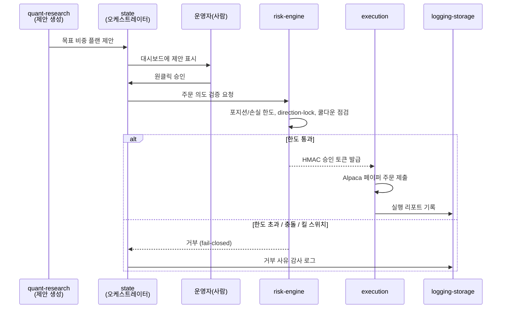

# 3.4편 — 플랜에서 주문으로: 승인 게이트 실행

[시리즈 홈 (한국어)](../README_kokr.md) | [English README](../README.md) | [This page in English](../en-us/part3_4_approval_gated_execution.md)

> *Series: 투자 비전문가가 AI 팀과 함께 알고리즘 트레이딩 시스템을 만든 기록 (5편 중 3.4편)*
>
> **범위와 한계.** 페이퍼 계정, 단일 윈도우. 이 소단원은 승인된 리밸런싱 플랜 항목이 승인 게이트 하에서
> 브로커 주문이 되는 과정을 다룹니다.

---

## 요약

- 시스템의 철학: **알고리즘이 제안하고, 사람이 승인하고, 리스크 엔진이 거부권을 쥡니다.**
- risk-engine의 **HMAC 토큰** 없이는 어떤 주문도 브로커에 도달하지 않습니다 — 토큰 없는 주문은 위조로 간주.
- 기본값은 **fail-closed**: 의심스러우면 막습니다. 모든 결정은 감사 로그로 남습니다.

---

## 1. 승인 게이트 흐름

여기서 "제안"은 3.3편의 리밸런싱 플랜으로, 알고리즘 서비스가 코드로 생성한 것 — LLM이 아닙니다. 고정된
게이트를 통해서만 실행으로 넘어갑니다.

3.3편의 차단된 세 거래(AAPL, ASX, INDV direction-lock)가 정확히 이 `else` 분기가 실제 산출물에 작동한
것입니다: 플랜은 매수를 요청했고, 게이트가 거부했으며, 거부 사유가 기록됐습니다.

## 2. 핵심 속성

1. 제안은 **자동 생성**되지만, 실행은 **사람의 승인**을 거칩니다.
2. risk-engine은 **HMAC 토큰**으로 모든 주문에 암호학적 게이트를 겁니다 — 토큰 없는 주문은 위조로 간주.
3. **fail-closed**: 의심스러우면 막습니다. 통과가 아니라 차단이 기본값.
4. 모든 결정은 **감사 로그**(`logging-storage`)로 남습니다.

HMAC 메커니즘은 모듈 간 신뢰를 약속에서 암호학적 증명으로 바꿉니다: 주문이 정당한 알고리즘 제안이든
결함이 만든 유령 주문이든, 유효한 risk-engine 토큰이 없으면 execution이 거부합니다. 비전문가가 만든
시스템에서 이 구조적 불신이 안전을 만듭니다.

## 3. 왜 사람이 루프에 남는가

제안 → 검토 → 실행 패턴은 돈이 움직이는 그 한 단계에 사람을 둡니다. 완전 자동화가 항상 옳지는 않습니다;
빌더가 비전문가일수록 마지막 단계에 사람과 거부권 레이어가 필요합니다. 비용은 밤마다 클릭 한 번이고,
이점은 어떤 최적화기 오류·데이터 결함·코드 버그도 스스로 주문을 낼 수 없다는 것입니다.

> **다음:** 4편은 실현 기록을 열어 손실을 인과적으로 읽습니다 — 927 라운드트립의 −$369.85가 실제 무엇이
> 었는지, 그리고 왜 단일 종목이 기간을 결정했는지.

