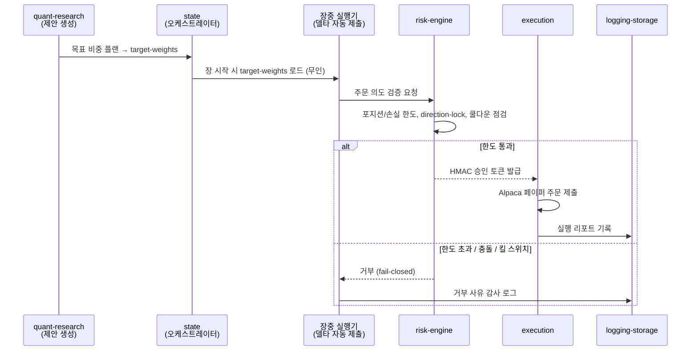

# 3.4편 — 플랜에서 주문으로: 자동 실행과 코드화된 거부권

[시리즈 홈 (한국어)](../README_kokr.md) | [English README](../README.md) | [This page in English](../en-us/part3_4_approval_gated_execution.md)

> *Series: 투자 비전문가가 AI 팀과 함께 알고리즘 트레이딩 시스템을 만든 기록 (5편 중 3.4편)*
>
> **범위와 한계.** 페이퍼 계정, 단일 윈도우. 이 소단원은 리밸런싱 플랜이 **사람 개입 없이 자동으로** 브로커
> 주문이 되는 과정과, 그 경로에서 **코드화된 risk-engine**이 어떻게 거부권을 행사하는지를 다룹니다.

---

## 요약

- InvestIQ는 **완전 자동** 알고리즘 트레이딩입니다: 제안 생성부터 주문 제출까지 사람의 주문별 승인이
  없습니다. **알고리즘이 제안하고, 코드화된 risk-engine이 거부권을 쥡니다.**
- risk-engine의 **HMAC 토큰** 없이는 어떤 주문도 브로커에 도달하지 않습니다 — 토큰 없는 주문은 위조로 간주.
- 기본값은 **fail-closed**: 의심스러우면 막습니다. 모든 결정은 감사 로그로 남습니다.
- 사람의 유일한 게이트는 주문 단위가 아니라 **실자본(live) 모드 무장**입니다. 페이퍼는 무인 자동이며,
  실행기는 **하드코딩으로 페이퍼 전용**(라이브 활성 시 제출 거부)입니다.

---

## 1. 자동 실행 흐름

여기서 "제안"은 3.3편의 리밸런싱 플랜으로, 알고리즘 서비스가 코드로 생성한 것 — LLM이 아닙니다. 야간
post-market 배치가 이를 `target-weights`로 기록하고, **장 시작 시 장중 실행기가 이를 읽어 사람 개입 없이**
현재 보유와의 차이(델타)만큼 주문합니다. 모든 주문은 고정된 코드 게이트를 통과해야만 실행됩니다.

3.3편의 차단된 세 거래(AAPL, ASX, INDV direction-lock)가 정확히 이 `else` 분기가 실제 산출물에 작동한
것입니다: 플랜은 매수를 요청했고, **게이트가 — 사람이 아니라 코드가 — 거부했으며**, 거부 사유가 기록됐습니다.

## 2. 핵심 속성

1. 제안 생성도 주문 실행도 **모두 자동**입니다. 사람의 주문별 승인 단계는 없습니다.
2. risk-engine은 **HMAC 토큰**으로 모든 주문에 암호학적 게이트를 겁니다 — 토큰 없는 주문은 위조로 간주.
3. **fail-closed**: 의심스러우면 막습니다. 통과가 아니라 차단이 기본값.
4. 모든 결정은 **감사 로그**(`logging-storage`)로 남습니다.

HMAC 메커니즘은 모듈 간 신뢰를 약속에서 암호학적 증명으로 바꿉니다: 주문이 정당한 알고리즘 제안이든
결함이 만든 유령 주문이든, 유효한 risk-engine 토큰이 없으면 execution이 거부합니다. 비전문가가 만든
완전 자동 시스템에서, 거부권을 **사람의 주의력이 아니라 코드**에 둔 이 구조적 불신이 안전을 만듭니다.

## 3. 사람은 어디에 남는가 — 실자본 무장 스위치

페이퍼 운영에서 사람은 개별 주문 루프에 없습니다. 사람이 쥔 단 하나의 게이트는 **실자본(live) 모드를
켜는 거래일 단위 무장 스위치**입니다 — 기본값은 꺼짐이고, 이 페이퍼 시리즈에서는 한 번도 켜지지 않았으며,
실행기 자체가 하드코딩으로 페이퍼 전용입니다. 따라서 사람은 *어느 종목을 살지*가 아니라 *실제 돈을 걸지*만
통제합니다.

나머지 사람의 역할은 실행 루프가 아니라 **개발·연구 층**(5편)에 있습니다: 전략을 설계·검증하고, 하드 캡과
거부권을 코드에 박아 넣는 것. 완전 자동화의 안전은 마지막 단계의 사람 클릭이 아니라, **돈이 움직이는 단계에
코드화된 fail-closed 거부권**과 그 위의 킬 스위치·실자본 무장 스위치에서 나옵니다.

> **다음:** 4편은 실현 기록을 열어 손실을 인과적으로 읽습니다 — 927 라운드트립의 −$369.85가 실제 무엇이
> 었는지, 그리고 왜 단일 종목이 기간을 결정했는지.

