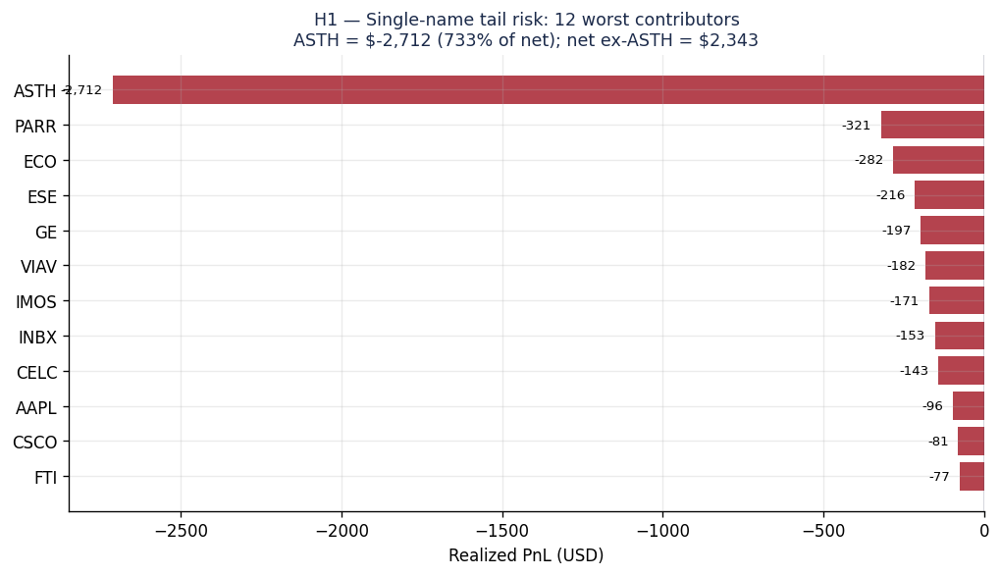
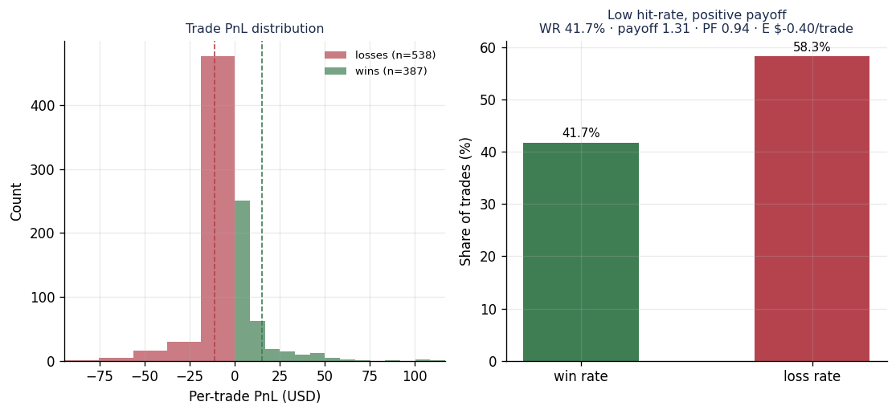
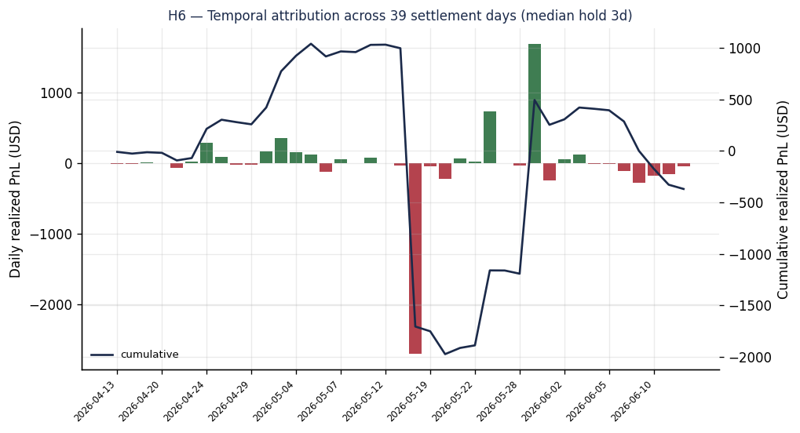
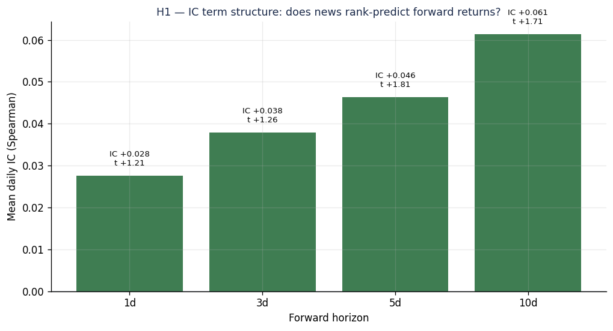
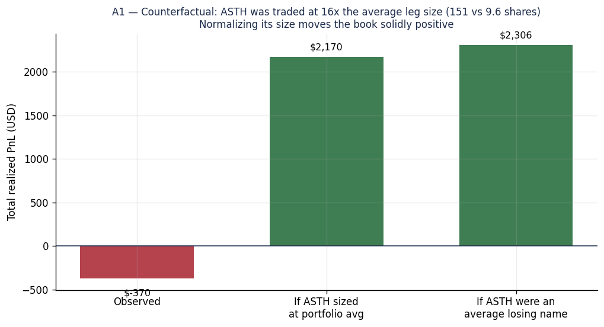

# 4편 — 손실의 실체: 거래 기록의 인과적 해석

[시리즈 홈 (한국어)](../README_kokr.md) | [English README](../README.md) | [This page in English](../en-us/part4_loss_attribution.md)

> *Series: 투자 비전문가가 AI 팀과 함께 알고리즘 트레이딩 시스템을 만든 기록 (5편 중 4편)*
>
> **범위와 한계.** 아래 수치는 Alpaca **페이퍼** 계정의 **체결 주문 기록**에서 재구성한 것이며,
> 단일 기간(2026-04-13 ~ 2026-06-13) 실험 결과입니다. 프록시가 아닌 실제 체결이지만, 하나의 시장 국면과 짧은
> 기간만을 다루므로 일반적 결론이 아니라 이 실험에 대한 기술(description)로 읽어야 합니다. 이 시스템은
> 설계상 롱(매수) 전용이며 숏 전략은 쓰지 않았습니다(기록에 남은 소수의 우발적 잔여 숏은 아래 1절에서 설명합니다).
> 결과는 하나의 숫자입니다. 평가(mark-to-market) 기준으로 계정 자기자본이 약 −$878 변했습니다(운영자
> 자기자본이 ~$25,000에서 ~$24,122로 하락). 

---

## 요약

- 계정의 **자본이 실험 기간 동안 ≈ −$878** 감소했습니다. 이는 **실현 −$452 + 미청산 미실현 −$339 + 수수료/슬리피지 −$88**로 분해됩니다.
- 종목별 귀인은 **−$369.85 롱 전용 마감 라운드트립** 수치(롱 133종목 927건)를 사용합니다. 구조적 붕괴가  아니라 사실상 손익분기에 가까운 결과입니다.
- 거래별 결과를 부트스트랩하면 총손익 95% 신뢰구간이 **[−$3,156, +$2,149]**로 0을 포함합니다. 통계적으로  **손익분기와 구별되지 않습니다.**
- 순손실의 거의 전부가 단일 종목에서 나왔습니다. **ASTH 한 종목이 −$2,712를 잃었고**, 나머지 종목은 합쳐
  **+$2,343 이익**이었습니다. ASTH의 큰 손실이 그 이익을 거의 상쇄해 전체가 −$370에 그쳤습니다. 즉 전략은
  넓게 분산돼 있고, 유일한 집중은 이 단일 종목 테일입니다.
- 프로파일은 **낮은 승률(41.7%) + 양(+)의 페이오프(1.31)** — 작은 개선으로 양수가 될 수 있는 한계적
  음(−)의 기대값입니다.
- 별도 연구에서 뉴스 감성 신호는 **방향성은 일관되나 통계적 검정력이 부족**했습니다. 검증도 기각도 되지 않았습니다.

---

## 1. 결과: 평가 기준 −$878의 손실

실험 기간동안 평가금 기준으로 계정 자본이 $25,000에서 약 −$878 감소한 $24,122로 마감 했습니다. 
현재도 일부 포지션을 갖고 있기 때문에 좀 더 구체적으로 평가 자산 기준으로는 다음과 같습니다.

| 구성요소 | 금액 | 라운드트립 수치가 놓치는 이유 |
|---|---:|---|
| 실현손익 (롱 + 잔여 숏 포함) | −$451.50 | 매도가 보유분을 초과해 생긴 `sell_short` 22건의 우발적 숏을 롱 전용 매처가 버림 |
| **미실현**손익 (2026-06-12 종가 평가, 37개 미청산) | −$338.66 | 실현 전용 매처는 미청산 재고(순 +188 롱 / −56 숏 주)를 평가하지 않음 |
| **수수료 / 슬리피지 / 반올림** | −$87.84 | 체결가에 포함되지 않음 (총 거래대금의 0.009%) |
| **총 자기자본 변화** | **−$878.00** | 관측 잔고와 일치 |

참고로 이 시스템은 롱(매수) 전용으로 설계되어 숏을 의도적으로 매매하지 않습니다. AI 개발팀의 실수로 위 22건의 `sell_short`는 숏 전략이 아니라 매도 주문 수량이 그 시점의 보유분을 초과해 우발적으로 열린 소규모 잔여 숏이며,
자기자본 정산을 정확히 하기 위해 포함하였을 뿐입니다.

실수를 제외한 나머지 종목별 분석은 깨끗하게 매칭된 롱 기록(−$369.85)을 다룹니다. 잔여 숏과 미청산 포지션이 그 위에
약 −$420을 더해 전체 −$878에 이른다는 점을 단서로 밝혀 둡니다.

| 지표 (롱 전용 마감 라운드트립) | 값 |
|---|---|
| 실현 손익 | −$369.85 |
| 라운드트립 | 927건 (133종목) |
| 승률 | 41.7% (387승 / 538패) |
| 평균 수익 / 손실 | +$14.93 / −$11.43 |
| 페이오프 비율 | 1.31 |
| 거래당 기대값 | −$0.40 |
| 수익 팩터 | 0.94 |
| 부트스트랩 95% CI | [−$3,156, +$2,149] |

---

## 2. 버그로 인한 손실

현재 평가금은 위에서 언급한 sell_short 버그외에 단위 환산 버그로 큰 소실을 입은 것도 포함되어있습니다. 
이 부분이 가장 큰 손실을 초래 했습니다. 

*그림. 손실 기여 상위 12개 종목. ASTH 한 종목이 −$2,712를 잃었는데, 이는 순손실 −$369.85의 7배가 넘습니다.
다음으로 큰 손실(PARR −$321, ECO −$282, ESE −$216, GE −$197)은 한 자릿수 작습니다. ASTH를 제외하면
나머지 북은 +$2,343 이익이며, ASTH의 손실이 이를 거의 상쇄해 전체가 −$370에 그쳤습니다.*

이는 전략에 영향을 주었습니다. 즉, InvestIQ에 손실은 광범위하게 나쁜 전략의 산물이 아니라, 
각 종목의 매수매도에 정확한 자본 비율을 적용하고 엄격하게 거래 수량을 관리하는 것이 중요하다는 교훈을 얻을 수 있습니다. 따라서 우리가 제어할 수 있는 레버는 광범위한 디리스킹이 아니라 **단일 종목 테일 통제**입니다.

## 3. 결과는 동전 던지기와 유사

그렇다면 돈을 적게 잃다는 것이 어떤 의미가 있는지 궁금해 할 수 있습니다. InvestIQ의 전략이 정말로 이익을 
내는지 아니면 돈을 잃는다고 얼마나 확신할 수 있을까요? 아쉽게도 현재 데이터로는 확신할 수 없습니다.

*그림. 927건의 거래별 결과를 부트스트랩(10,000회 재표집)하면 총손익 95% 구간이 [−$3,156, +$2,149]입니다.
구간이 0을 포함하며, 재표집의 40%가 0 이상(이익)입니다.*

수정된 두 개의 버그로 인한 손실을 감안하더라도 향후 전략 개선 없이도 다시 손실을 매꾸고 이익도 손실도 없는 손익분기에 앉을 수 있는 구조적 위치에 있다는 점이 중요합니다. 부트스트랩 신뢰구간이 0을 포함하는 것은 이 기간의 결과가 통계적으로 손익분기와 구별되지 않음을 의미합니다. 즉, 이 전략이 이익을 낸다고도, 돈을 잃는다고도 확신할 수 없습니다.

## 4. 거래 프로파일: 낮은 승률, 양의 페이오프

*그림. 승률 41.7%, 평균 수익 +$14.93 대 평균 손실 −$11.43 — 페이오프 비율 1.31. 양의 페이오프가 50% 미만
승률을 거의 상쇄합니다. 기대값은 거래당 −$0.40, 수익 팩터는 0.94.*

아쉽게도 InvestIQ가 실행하는 전략은 절반 미만 확률로 수익이 손실보다 큽니다. 엣지는 한계적으로 음수이나, 수정된 버그로 프로그램을 계속 운영하면 승률이나 페이오프의 작은 개선이 기대값을 양수로 옮길 것입니다. 이는 전략이 개선될 여지가 있다는 것을 시사하지만, 현재로서는 이 기간의 결과가 손익분기와 구별되지 않는다는 점을 다시 한 번 강조합니다. 전략이 개선되면 승률과 페이오프가 개선되어 기대값이 양수로 이동할 수 있지만, 현재로서는 이 기간의 결과가 손익분기와 구별되지 않는다는 점을 다시 한 번 강조합니다.

## 5. 리스크는 테일을 제외하면 분산돼 있다

*그림. 74개 종목이 손실을 기여했고, 손실측 허핀달 지수는 0.27로 유효 베팅 약 3.7개에 해당합니다. ASTH를
제외하면 단일 종목 손실이 약 $320를 넘지 않습니다.*

즉 우리가 디자인했던 포트폴리오 최적화의 목적을 일부 달성했다고 볼 수 있습니다. 초기 아무런 종목도 없이 시작해서
뉴스 분석과 유니버스 스크리닝, 포트폴리오 최적화와 투자 비율 결정에 따라 사람의 계입없이 관리가 이루어 졌습니다.
큰 손실을 입었던 단일 종목을 제외하면 손실이 여러 섹터와 종목에 걸쳐 분산 되었다는 것을 확인 했습니다. 

## 6. 부분 체결과 슬리피지 

*그림. 주문 866건 중 742건 체결, 100건 취소. 체결의 43%가 부분 체결. 회전율과 슬리피지 표면을 더하지만,
ASTH 테일에 비하면 마찰은 분산돼 있고 작습니다.*

주문이 취소되거나 일부만 체결되는 문제가 있었지만, 이것이 손실의 원인은 아닙니다. 중복 주문을 막고 부분 체결을 감시하는 일은 시스템을 건강하게 유지하기 위해 가치 있지만, 이번 기간의 손익을 가른 결정적 요인은 아닙니다.

## 7. 손실은 시간적이 아니라 구조적이다 (H6)

*그림. 정산일별 실현 손익은 42일 윈도우에 걸쳐 부호가 교차합니다(중앙 보유기간 3일). 누적 경로는 한 번에
계단식으로 떨어지지 않고 표류합니다. ASTH 테일은 단일 세션이 아니라 자체 40건의 라운드트립에 분산돼 있습니다.*

포트폴리오는 여러 종목들로 구성되였기 때문에 손실은 어느 특정한 하루에 크게 발생하지 않았습니다. 날짜별로 보면
이익과 손실이 번갈아 나타날 뿐, 자산이 하루아침에 뚝 떨어지지 않고 조금씩 오르내리며 흘러갑니다. 결국 손실의
진짜 원인은 장이 좋지안은 날이 아니라 한 종목(ASTH)에 대한 거래 실수였으며, 그 한 종목의 손실조차 단 한 번의
거래가 아니라 40번의 매매에 걸쳐 쌓인 것입니다. 즉 문제는 시점(언제)이 아니라 구조(어느 종목)에 있습니다.

---

## 8. 뉴스 신호: 일관되나 미확정

본 문서에 포함은 안되어있지만 별도 연구는 뉴스 감성 신호가 거래 종목들의 미래 수익을 예측했는지 연구 했었습니다. 
이 연구의 가격은 Alpaca Market Data에서, 감성은 InvestIQ news-intel 일별 집계값을 하루 지연시켜 사용했습니다.

*그림. 정보계수는 모든 호라이즌에서 양수이며 단조 증가합니다(1d +0.028 → 10d +0.061). 그러나 어느 호라이즌도
|t| ≥ 2 기준을 넘지 못하며, 5일 호라이즌이 t = 1.81로 가장 근접합니다.*

뉴스 감성 점수가 높은 종목일수록 이후 수익이 좋은 경향이 실제로 나타났습니다. 종목을 감성 점수에 따라
상/중/하 세 그룹으로 나눠 보면, 가장 긍정적인 상위 1/3 종목은 이후 3일간 평균 +0.86% 오른 반면 가장
부정적인 하위 1/3 종목은 +0.28%에 그쳤습니다(둘의 차이 +0.58%포인트). 가격 흐름(모멘텀)의 영향을 걷어낸
뒤에도 뉴스의 효과는 같은 방향(긍정적)으로 남았습니다. 모든 분석이 한결같이 "뉴스 감성이 도움이 된다"는
쪽을 가리켰지만, 44일이라는 짧은 기간 탓에 어느 것도 통계적으로 "우연이 아니다"라고 단정할 만큼 확실하지는
않았습니다. 결론은 **방향은 그럴듯하지만 표본이 작아 확정할 수 없는, 시장 국면에 따라 달라질 수 있는 신호**로 다시 말하면 인과관계의 증거라고까지는 말할 수 없습니다.

---

## 9. 진행 방향

무엇을 먼저 고칠지는 "이 실험이 실패했다"는 식의 이야기가 아니라, 앞에서 하나씩 확인한 사실에서 그대로
나옵니다. 각 발견이 어떤 조치로 이어지는지 정리하면 다음과 같습니다:

| 무엇을 발견했나 | 무엇을 해야 하나 |
|---|---|
| 버그로 인한 손실 — 단일 종목 테일(ASTH) | 종목별 실현손실 캡 + 노출 상한 추가 — 최고 레버리지 수정 |
| 거래 프로파일 — 한계적 음의 엣지 | 익절 규율 + 진입 품질 필터로 기대값을 0 위로 |
| 부분 체결과 슬리피지 — 실행 마찰 | 주문 멱등성 + 부분 체결/슬리피지 텔레메트리 |
| 결과는 동전 던지기와 유사 — 손익분기 | 엣지를 미검증으로 취급 — 기대값 모니터 + fail-closed 킬 스위치 |
| 리스크는 테일을 제외하면 분산 | 건강함 — 본체를 과도하게 디리스킹하지 말 것 |

분산되고 손익분기에 가까운 포트폴리오가 단일 종목에 기간을 내주었고, 해법은 그 단일 종목을 통제하는 것이지 전략을
재구축하는 것이 아닙니다.

---

## 부록 A — 북을 받친 수익 기여 종목

같은 기록의 반대편은 이익이 어디서 왔는가입니다. 북에는 **수익 종목 59개**가 있었고, 상위 12개만으로
**+$4,224**를 기여했습니다 — 단일 ASTH 테일을 제외한 모든 손실 종목을 상쇄하고도 남는 규모입니다.

*그림. 수익 기여 상위 12개 종목. STX가 +$1,264로 선두했고, 그 뒤를 GTX +$870, TTMI +$481, INDV
+$467이 이었습니다. INDV는 일관성이 돋보이며(30건 라운드트립 중 29승 1패), INTC·ON·CVX는 모든 마감
레그에서 수익이었습니다.*

이익은 손실보다 더 넓고 꾸준합니다: 수익 종목은 높은 종목별 승률로 여러 종목에 분산된 반면, 손실은 하나에
집중됩니다. 그 비대칭 — 꾸준한 수익 종목의 분산된 기반 대 하나의 과대한 손실 종목 — 이 이 기간이 적자 깊은
곳이 아니라 손익분기에 앉는 핵심 이유입니다.

---

## 부록 B — 반사실: ASTH의 손실이 평균 수준이었다면

2절의 단일 종목 테일에는 구체적이고 기계적인 원인이 있습니다: **ASTH는 북의 다른 어떤 종목보다도 훨씬 큰
규모로 거래됐습니다.** 라운드트립이 레그당 평균 **151주**였는데, 북 전체 평균은 **9.6주** — 약 **16배 과대
주문**이며 단일 레그는 최대 1,195주에 달했습니다. 따라서 손실 크기는 방향성 판단만큼이나 포지션 사이징의
산물입니다: 평균 규모의 포지션에서 동일한 불리한 가격 움직임이었다면 평범한 손실을 냈을 것입니다.

반사실은 그 사이징이 없었다면 — 즉 ASTH의 손실이 이상치가 아니라 평균 수준의 손실이었다면 — 이 기간이
어떻게 됐을지 묻습니다.

*그림. 관측 총액 −$370 대 두 가지 사이즈 정규화 반사실. ASTH 포지션을 북 평균 레그 크기로 축소하면
북이 **+$2,170**이 되고, ASTH를 평균적인 손실 종목(다른 73개 손실 종목 평균 −$36)으로 보면 **+$2,306**
이 됩니다.*

| 시나리오 | ASTH 기여 | 총 실현 손익 |
|---|---:|---:|
| 관측 | −$2,712 | −$370 |
| ASTH를 북 평균 규모로 (손실 9.6 / 151로 축소) | −$173 | **+$2,170** |
| ASTH를 평균적 손실 종목으로 | −$36 | **+$2,306** |

두 반사실 모두 **+$2,200** 근처에 안착해, 손익분기에 가까운 기간을 명확히 양(+)의 기간으로 바꿉니다.
해석은 전략이 은밀히 수익적이었다는 것이 아니라 — 3절은 여전히 관측 결과가 통계적으로 손익분기와 구별되지
않음을 유지합니다 — **실현 손실의 단일 최대 동인이 신호 품질이 아니라 한 종목의 포지션 크기였다**는
것입니다. 바로 이것이 9절의 최우선 교정책이 종목별 노출 상한인 이유입니다: 사이즈 하드 캡은 거래의 옳고
그름과 무관하게 ASTH 레그가 북을 지배하는 것을 막았을 것입니다.

