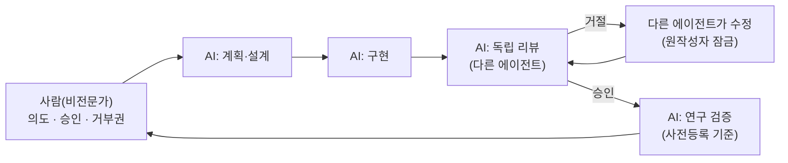

# 5편 — 교훈: AI와 함께 기술 시스템을 다룰 때

[시리즈 홈 (한국어)](../README_kokr.md) | [English README](../README.md) | [This page in English](../en-us/part5_lessons_for_working_with_ai.md)

> *Series: 투자 비전문가가 AI 팀과 함께 알고리즘 트레이딩 시스템을 만든 기록 (5편 중 5편)*
>
> **범위와 한계.** 이 시리즈의 모든 수치는 단일 윈도우의 Alpaca 페이퍼 계정 실현 손익입니다. 이번 편은 그
> 한계 자체에서 끌어낸 방법론적 교훈입니다.

---

## 요약

- 비전문 투자자가 AI 팀과 함께 시스템을 만들며 배운 핵심은 "AI를 잘 쓰면 무엇이든 만들 수 있다"가 아니라
  "잘 만든다고 해서 목표를 이루는 것은 아니다"였습니다.
- 네 가지 교훈: ① 비전문 투자자도 AI를 잘 활용하면 기계적인 주식 투자 프로그램을 만들 수 있다, ② 개발 생산성과
  일관성을 위해 멀티 에이전트(하네스) 협업·검토 기법을 반드시 도입하라, ③ 메모리를 활용해 같은 버그의 반복을
  막아라, ④ 프로그램이 의도대로 돌아가도 목표를 이룬 것은 아니다 — 도메인 전문가의 설계가 선행되어야 한다.
- 의사결정권자를 위해: AI는 빠르게 결과물을 만들지만, 그 결과물이 실제 목적을 달성하는지 판단하고 설계하는 것은
  여전히 사람의 책임입니다.

---

## 1. 이 루프는 거래가 아니라 개발을 위한 것

프로젝트는 한 사람이, 역할이 분리된 AI 팀과 함께 만들었습니다. 이 루프는 알고리즘 프로그램을 개발·검증하며,
실거래는 에이전트가 아니라 완성된 코드가 돌립니다.

핵심 속성은 **같은 에이전트가 만들고 동시에 리뷰하지 않는다**는 것입니다. 구현 에이전트, 리뷰 에이전트, 연구
검증 에이전트가 독립적입니다 — "작성자가 자기 PR을 승인할 수 없다"와 같은 원칙입니다. AI 팀의 가장 큰
위험은 에코 체임버입니다: 한 모델이 낙관적으로 코드를 쓰면 같은 모델이 그 낙관을 승인합니다. 리뷰어
독립성을 강제하는 것 — 거절 시 원작성자 잠금 — 이 구조적 방어입니다.

---

## 2. 네 가지 교훈

### 교훈 ① 비전문 투자자도 AI를 잘 활용하면 기계적 투자 프로그램을 만들 수 있다

InvestIQ는 주식·퀀트 비전문가가 시작해, 데이터 수집부터 종목 선별, 포트폴리오 최적화, 주문 실행까지 갖춘
자동 투자 프로그램으로 완성됐습니다. 전문 지식의 공백은 AI 팀이 메웠습니다 — 비전문가는 "무엇을 원하는지"와
"무엇을 승인할지"를 정하고, 구현의 세부는 AI가 채웠습니다. 즉 AI를 잘 활용하면 한 사람의 비전문가도
과거에는 팀이 필요했던 수준의 기계적 시스템을 만들 수 있다는 것이 첫 번째 교훈입니다.

### 교훈 ② 멀티 에이전트(하네스) 협업·검토 기법을 반드시 도입하라

개발 생산성과 일관성을 위해서는 단일 에이전트 하나에 의존하지 말고, 역할이 분리된 여러 에이전트가 서로
협업하고 검토하는 구조(하네스)를 반드시 도입해야 합니다. 1절에서 본 것처럼 구현 에이전트, 리뷰 에이전트,
검증 에이전트를 분리하면 "작성자가 자기 작업을 스스로 승인"하는 에코 체임버를 막을 수 있습니다. 에이전트
하나만 쓸 때보다 여러 에이전트가 다른 역할로 교차 검토할 때, 더 정교하고 일관된 결과물이 나옵니다.

### 교훈 ③ 메모리를 활용해 같은 버그의 반복을 막아라

AI와 협업하다 보면 같은 종류의 버그가 반복해서 되살아납니다(실제로 4편의 단위 환산 버그와 `sell_short` 버그가
그 예입니다). 이를 막으려면 작업 내용과 한번 겪은 실수를 "기억"하게 하는 메모리 구조가 반드시 필요합니다.
작업 이력·결정·버그 이력을 기록하고 다시 참조하게 해주는 다양한 오픈소스 도구를 적극 활용해, 같은 실수를
두 번 반복하지 않도록 만드는 것을 권장합니다.

### 교훈 ④ 의도대로 돌아가도 목표를 이룬 것은 아니다 — 도메인 전문가의 설계가 선행되어야 한다

프로그램이 설계한 대로 잘 개발되고 운영된다고 해서, 그것이 곧 실제 목표를 달성했다는 뜻은 아닙니다.
InvestIQ의 목적은 이익 창출이었지만 실제 결과는 손실이었습니다. 즉 AI를 활용한 개발이 "잘 동작하는 시스템"으로
이어질 수는 있어도 "성공한 프로젝트"로 이어진다는 보장은 없습니다. 그래서 어떤 목표를 가진 프로젝트든, AI로
구현에 들어가기 전에 그 분야 도메인 전문가의 설계가 반드시 선행되어야 한다는 것이 이번 실험의 마지막 교훈입니다.

---

시리즈의 일관된 흐름: 이번 실험이 남긴 가치는 수익을 낸 전략이 아니라 — 실현 결과는 손익분기에 가까운
손실이었습니다 — 비전문가도 AI 팀과 함께라면 정교한 시스템을 만들 수 있다는 가능성과, 동시에 그 시스템이
목표를 이루려면 도메인 전문가의 설계가 앞서야 한다는 분명한 한계였습니다.

