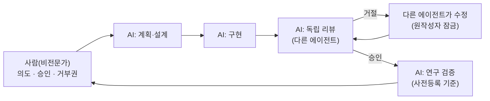

# 5편 — 교훈: AI와 함께 기술 시스템을 다룰 때

[시리즈 홈 (한국어)](../README_kokr.md) | [English README](../README.md) | [This page in English](../en-us/part5_lessons_for_working_with_ai.md)

> *Series: 투자 비전문가가 AI 팀과 함께 알고리즘 트레이딩 시스템을 만든 기록 (5편 중 5편)*
>
> **범위와 한계.** 이 시리즈의 모든 수치는 단일 윈도우의 Alpaca 페이퍼 계정 실현 손익입니다. 이번 편은 그
> 한계 자체에서 끌어낸 방법론적 교훈입니다.

---

## 요약

- AI로 트레이딩 시스템을 만들며 비전문가가 배운 것은 알파를 찾는 법이 아니라 자기 자신을 속이지 않는 법이었습니다.
- 다섯 교훈: ① 결과를 보기 전에 기준을 고정하라(사전등록), ② 편리한 기록이 아니라 권위 있는 기록을 신뢰하라,
  ③ 분석 유니버스와 거래 유니버스를 분리하라, ④ 하드 캡은 코드로 박아라, ⑤ 자동화 파이프라인에 거부권을 두어라.
- 의사결정권자를 위해: AI는 답을 빠르게 내놓지만, 틀릴 수 있는 — 그리고 스스로를 잡아내는 — 구조를 설계하는
  것은 여전히 사람의 책임입니다.

---

## 1. 이 루프는 거래가 아니라 개발을 위한 것

프로젝트는 한 사람이, 역할이 분리된 AI 팀과 함께 만들었습니다. 이 루프는 알고리즘 프로그램을 개발·검증하며,
실거래는 에이전트가 아니라 완성된 코드가 돌립니다.

핵심 속성은 **같은 에이전트가 만들고 동시에 리뷰하지 않는다**는 것입니다. 구현 에이전트, 리뷰 에이전트, 연구
검증 에이전트가 독립적입니다 — "작성자가 자기 PR을 승인할 수 없다"와 같은 원칙입니다. AI 팀의 가장 큰
위험은 에코 체임버입니다: 한 모델이 낙관적으로 코드를 쓰면 같은 모델이 그 낙관을 승인합니다. 리뷰어
독립성을 강제하는 것 — 거절 시 원작성자 잠금 — 이 구조적 방어입니다.

---

## 2. 다섯 교훈

### 교훈 ① 결과를 보기 전에 기준을 고정하라

뉴스 연구(4편)는 데이터를 보기 전에 가설·검정·합격 기준을 문서로 고정했습니다(`PRE_REGISTRATION.md`).
기준이 잠겨 있었기에, 정직한 결과 — 방향성은 일관되나 **검정력이 부족한 미확정** 신호 — 를 골대를 옮기지 않고
보고할 수 있었습니다. AI는 많은 가설을 빠르게 시도합니다. 사전등록이 없으면 결국 우연히 좋아 보이는 것을
찾아내고, 그 산물이 발견으로 오인됩니다.

### 교훈 ② 편리한 기록이 아니라 권위 있는 기록을 신뢰하라

로컬 이벤트 저널은 주문이 전송됐다는 것은 기록했지만 체결 가격은 기록하지 않았습니다. 편리한 로컬 데이터는
불완전했습니다. 해법은 **브로커 자체의 체결 주문 기록**으로 이동하는 것 — Alpaca API가 실제 체결을 반환합니다
— 그 위에 손실 분석을 재구축했습니다. 교훈: 편리한 로컬 로그는 진실의 원천이 아닙니다. 로컬 산물과 권위 있는
시스템이 불일치하면, 권위 있는 쪽 위에 구축하십시오.

### 교훈 ③ 분석 유니버스와 거래 유니버스를 분리하라

뉴스는 수천 개의 문자열을 언급하지만 거래 가능한 티커로 해석되는 것은 소수입니다. 재구축한 연구는 유니버스를
**실제 거래한 종목**으로 범위 지정해, 분석을 실제 결정에 정렬시키고 와이드 추론 유니버스와 좁은 거래
유니버스를 섞는 선택 편향을 피했습니다. "분석에 쓸 수 있는 종목"과 "실제 보유해도 되는 종목"은 다른
모집단입니다.

### 교훈 ④ 하드 캡은 코드로 박아라

4편은 기간 손실 전부가 단일 종목 테일(ASTH, 순 결과 전체보다 큼)에서 왔음을 보였습니다. 방어는 구조적입니다:
종목별 실현손실 캡과 노출 상한을, 최적화기 목적함수의 소프트 페널티가 아니라 실행 경로에서 강제합니다.
최적화기는 명시적으로 막지 않은 것은 무엇이든 합니다.

### 교훈 ⑤ 자동화 파이프라인에 거부권을 두어라

제안 → 검토 → 실행 패턴, HMAC 토큰, fail-closed 기본값, 사람 승인은 돈이 움직이는 그 한 단계에 거부권을
둡니다. 완전 자동화가 항상 옳지는 않습니다. 빌더가 비전문가일수록 마지막 단계에 사람과 거부권 레이어가
필요합니다.

---

## 3. 실전 체크리스트

| 단계 | 질문 | 함정 |
|---|---|---|
| 가설 | 데이터를 보기 전에 기준을 적었는가? | 결과를 보고 가설을 바꿈(HARKing) |
| 데이터 | 이것은 권위 있는 기록인가, 편리한 사본인가? | 불완전한 로컬 로그를 신뢰 |
| 유니버스 | 분석 집합이 거래 집합과 같은가? | 둘을 섞어 생긴 선택 편향 |
| 사이징 | 캡이 실행 경로의 하드 제약인가? | 최적화기의 자가 분산을 신뢰 |
| 실행 | 돈이 움직이는 단계에 거부권이 있는가? | 사람 게이트 없는 완전 자동화 |

시리즈의 일관된 흐름: 가치는 수익 전략이 아니라 — 실현 결과는 손익분기에 가까운 손실이었습니다 — **정직하게
틀리는 반복 가능한 방법**이었습니다. 비전문가에게는, 스스로를 점검하는 AI 팀을 통해 강제된 그 방법이 지속되는
산출물입니다.

